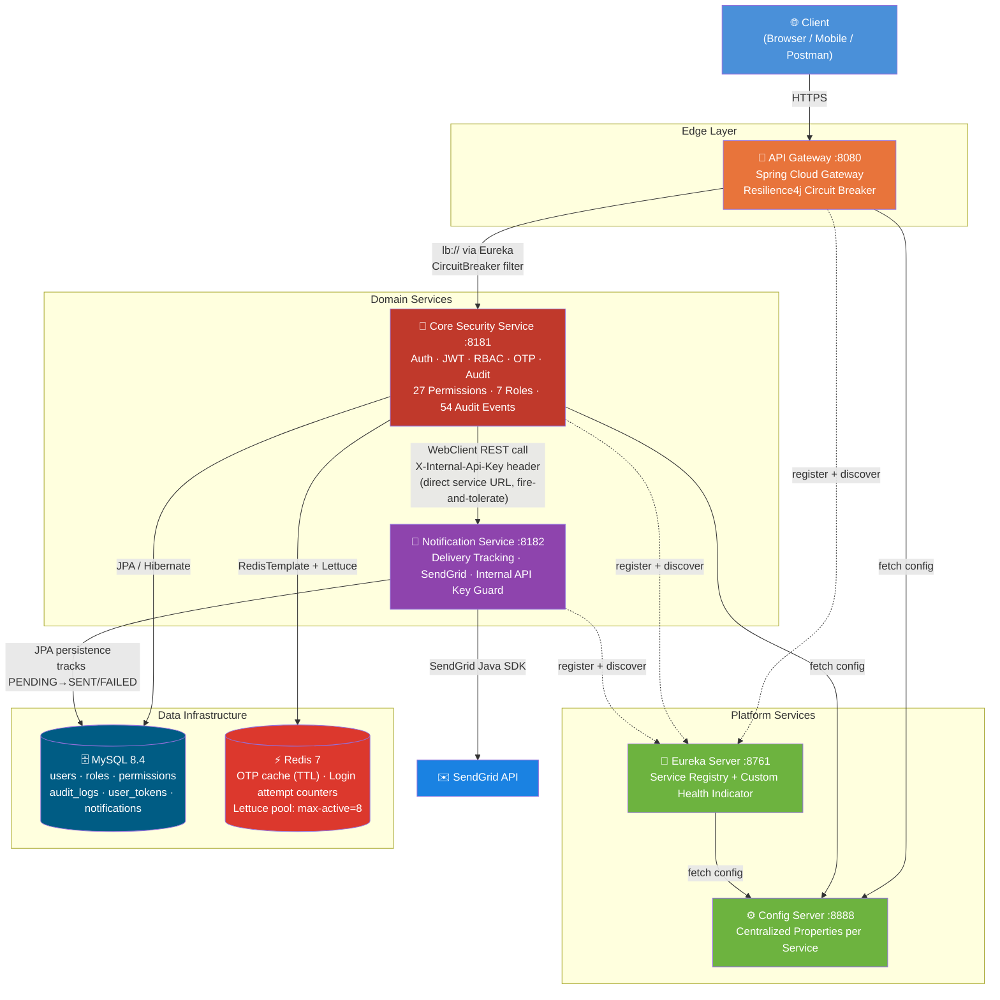
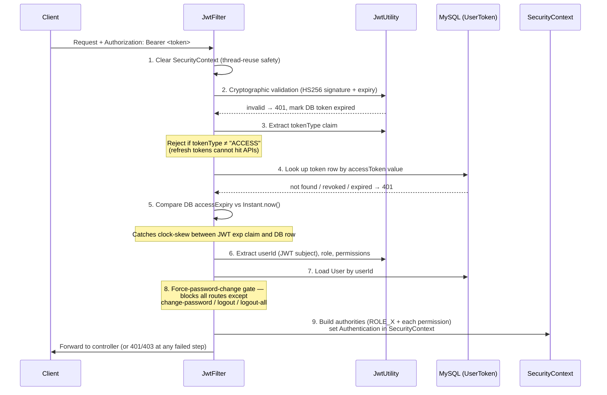
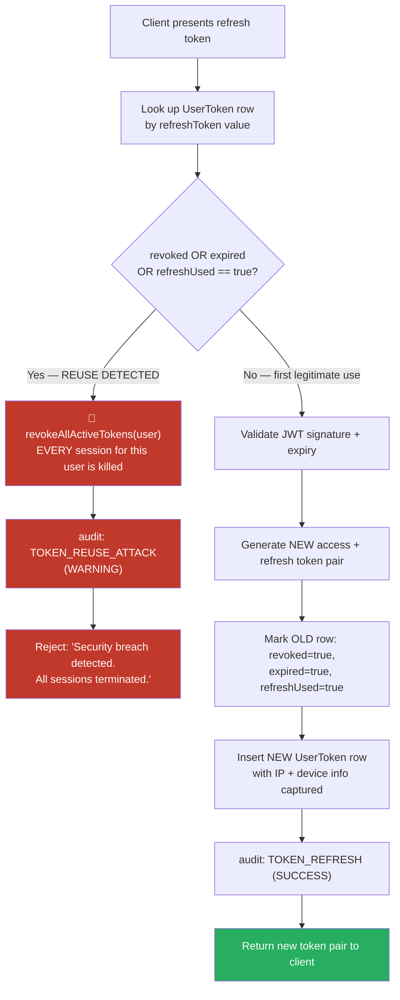
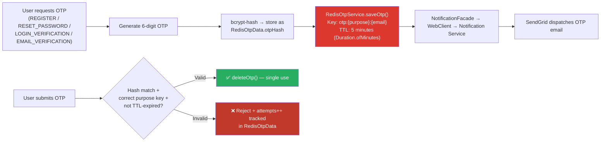
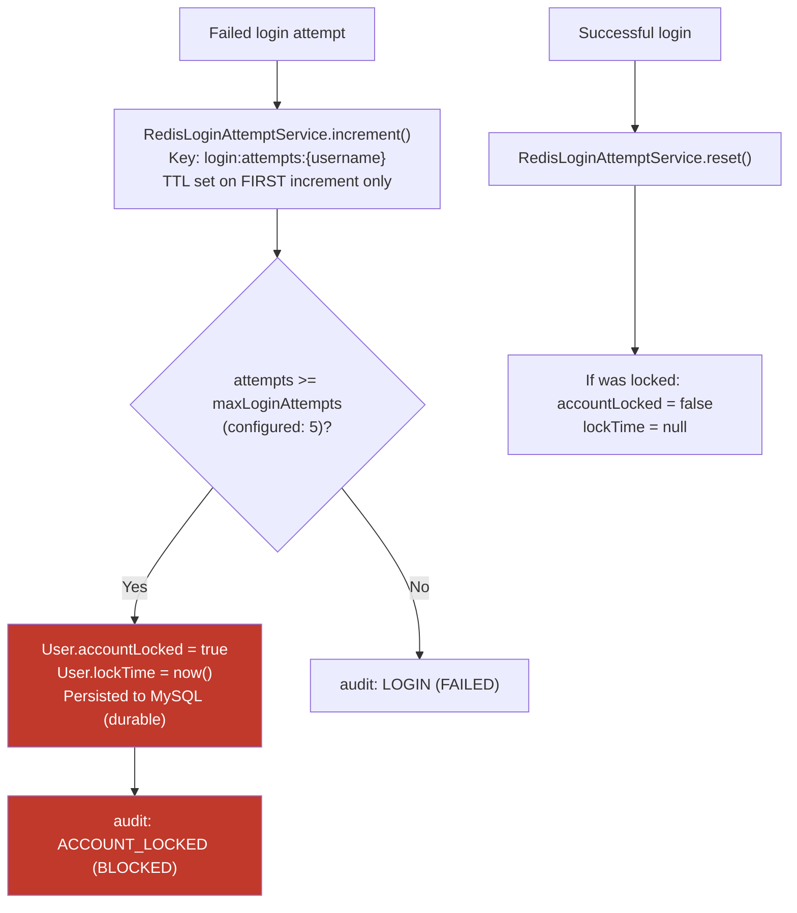
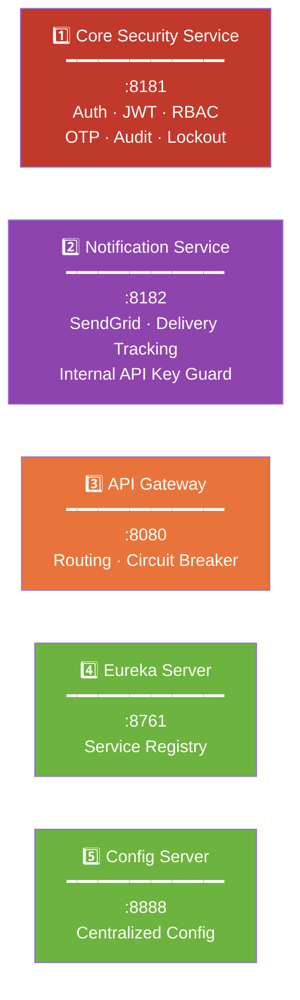
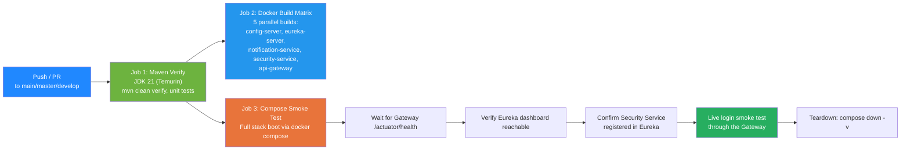

<div align="center">

# 🛡️ Production Prototype Security Template

### A Distributed Identity & Access Management Platform — Built Microservice by Microservice

**Spring Boot 3 · Spring Security 6 · JWT · RBAC · Redis · Resilience4j · Eureka · Docker · CI/CD**

[](https://www.oracle.com/java/)
[](https://spring.io/projects/spring-boot)
[](https://spring.io/projects/spring-security)
[](https://redis.io/)
[](https://www.mysql.com/)
[](https://www.docker.com/)
[](https://github.com/features/actions)
[](https://jwt.io/)

[]()
[]()
[]()
[]()
[]()
[]()

**A self-contained identity platform — five independently deployable Spring Boot services that handle authentication, authorization, OTP verification, session lifecycle, notification delivery, and full security auditing for any product built on top of it.**

[Architecture](#-system-architecture) • [Security Engineering](#-security-engineering--what-makes-this-production-grade) • [Services](#-the-five-microservices) • [Resilience & DevOps](#-resilience-observability--devops) • [API Surface](#-api-surface) • [Run It](#-running-the-platform)

</div>

---

## 📌 What This Project Is

Most "JWT auth" repositories are a single Spring Boot app with a login endpoint and a filter bolted on. **This isn't that.**

This is a **distributed identity and access management platform** — five independently deployable, independently scalable Spring Boot services that together form the security backbone a real product would sit on top of: a **Core Security Service** (auth, RBAC, OTP, audit), a **Notification Service** (transactional email delivery with full delivery tracking), an **API Gateway** (single entry point with circuit-breaking), a **Eureka Server** (service discovery), and a **Config Server** (centralized configuration).

Every claim in this README was verified by reading the actual source code, configuration files, Dockerfiles, and CI pipeline in this repository — not copied from a template description. The numbers below (27 permissions, 54 audit event types, 7 roles, 5 services) are exact counts taken directly from the enums and seed data in the codebase.

> 💡 **The engineering principle behind this project:** Authentication and authorization should never live inside business logic. They should be a standalone platform — one that every other service in an organization can trust, call, and audit — built with the same rigor as the product it protects.

---

## 🏗️ System Architecture

### Full Distributed Topology



> **Honest architectural note:** Inter-service communication between the Core Security Service and the Notification Service is **synchronous REST via Spring `WebClient`**, authenticated with a custom `X-Internal-Api-Key` header — not a message broker. Both services register with Eureka for discoverability and health visibility, but the WebClient call itself targets the Notification Service's Docker Compose DNS name directly. This is a deliberate, documented trade-off (see `NotificationFacadeImpl` — "fire-and-tolerate": a notification failure is caught and logged but **never rolls back the calling transaction**).

### The 9-Step JWT Filter Chain (`JwtFilter.java`)

This is the literal sequence implemented in `doFilterInternal()` — every authenticated request passes through every step, in this exact order:



### Refresh Token Rotation with Reuse-Attack Detection (`AuthServiceImpl.refreshToken()`)



### OTP Lifecycle — Redis-Backed, Purpose-Isolated, bcrypt-Hashed



### Hybrid Redis + MySQL Account Lockout (Brute-Force Protection)



> **Why hybrid, not Redis-only:** the attempt **counter** lives in Redis (fast, auto-expiring via TTL — `security.account.failed-attempt-expiry-minutes=30`), but the **lock state itself** is persisted to MySQL on the `User` entity. If Redis restarts or is flushed, a genuinely locked account stays locked — the durable system of record never depends on the ephemeral cache.

---

## 🧰 Technology Stack — Verified Against `pom.xml`

<table>
<tr><th>Layer</th><th>Technology</th><th>Where It's Used / Why</th></tr>

<tr><td><b>Language & Build</b></td><td>Java 21, Maven (multi-module reactor)</td><td>One parent <code>microservices-parent</code> POM aggregates all 5 service modules with shared dependency management via <code>spring-cloud-dependencies</code> BOM</td></tr>

<tr><td><b>Security Framework</b></td><td>Spring Security 6, <code>@EnableMethodSecurity</code></td><td>Stateless filter chain, method-level <code>@PreAuthorize("hasAuthority(...)")</code> on every sensitive endpoint, custom <code>DaoAuthenticationProvider</code></td></tr>

<tr><td><b>Tokens</b></td><td>JJWT (<code>jjwt-api</code>/<code>impl</code>/<code>jackson</code>), HS256</td><td>Access + refresh token pair; secret strength validated at startup (rejects sub-256-bit or common weak secrets)</td></tr>

<tr><td><b>Caching</b></td><td>Spring Data Redis + Lettuce, <code>commons-pool2</code></td><td>OTP storage (TTL), login-attempt counters; connection pool explicitly tuned (<code>max-active=8</code>, <code>max-idle=4</code>, <code>min-idle=1</code>)</td></tr>

<tr><td><b>Persistence</b></td><td>Spring Data JPA + Hibernate, MySQL 8.4</td><td><code>ddl-auto=update</code> schema management; indexed tables for users, audit_logs, user_tokens, notifications</td></tr>

<tr><td><b>API Gateway</b></td><td>Spring Cloud Gateway, <code>spring-cloud-starter-circuitbreaker-reactor-resilience4j</code></td><td>Load-balanced routing (<code>lb://</code>) through Eureka, named circuit breaker with fallback route</td></tr>

<tr><td><b>Service Discovery</b></td><td>Netflix Eureka (server + client)</td><td>All 5 services self-register; Eureka Server ships a custom <code>HealthIndicator</code></td></tr>

<tr><td><b>Centralized Config</b></td><td>Spring Cloud Config Server</td><td>Native, file-based config repo serving per-service properties (e.g. Gateway routes)</td></tr>

<tr><td><b>Inter-Service HTTP</b></td><td>Spring WebFlux <code>WebClient</code></td><td>Reactive, non-blocking REST calls from Core Security Service to Notification Service</td></tr>

<tr><td><b>Transactional Email</b></td><td>SendGrid Java SDK</td><td>Behind a pluggable <code>EmailProvider</code> interface — SendGrid is the current implementation, not a hard dependency</td></tr>

<tr><td><b>Logging</b></td><td>SLF4J + Logback (Spring Boot default)</td><td>25 <code>@Slf4j</code>-annotated classes, 175 structured log statements using consistent <code>key=value</code> pattern (e.g. <code>"userId={} | role={}"</code>)</td></tr>

<tr><td><b>API Documentation</b></td><td>springdoc-openapi (Swagger UI)</td><td>Live OpenAPI spec + Swagger UI, explicitly excluded from Actuator exposure</td></tr>

<tr><td><b>Testing</b></td><td>JUnit 5, Spring Boot Test, <b>Testcontainers</b> (MySQL + Redis)</td><td>Integration tests spin up real Dockerized MySQL and Redis — not mocks — via <code>@Testcontainers</code></td></tr>

<tr><td><b>Containerization</b></td><td>Docker (multi-stage builds), Docker Compose</td><td>5 services + MySQL + Redis orchestrated with explicit healthchecks and dependency ordering</td></tr>

<tr><td><b>CI/CD</b></td><td>GitHub Actions</td><td>3-job pipeline: Maven verify → matrix Docker build (5 services) → full Compose smoke test with live login check</td></tr>

</table>

---

## 🧩 The Five Microservices



### 1️⃣ Core Security Service (`springboot-security-jwt-rbac-app4`)

The heart of the platform. ~600-line `AuthServiceImpl`, a dedicated `JwtFilter`, and a layered service architecture:

- **Login flow:** credential check via Spring Security's `AuthenticationManager` → auto-unlock-if-expired check → active/enabled/locked status gates → **revoke all prior active sessions** (single-active-session policy) → issue new token pair
- **Employee registration with admin approval:** new employees register with a `requestedRole`, status goes to `PENDING_APPROVAL`, and a dedicated `RegistrationApprovalController` lets permission-holders approve or reject — each action notifies the requester via the Notification Service
- **Force password change:** a boolean flag on `User` that, when set, blocks every route except `change-password`, `logout`, and `logout-all` — enforced directly in the JWT filter, not just at the UI layer
- **Session management API:** `/api/v1/auth/sessions` lists active sessions, `/sessions/{id}` revokes a specific one, `/logout-all` kills every session for the user
- **Admin operations:** force-logout, token revocation, account lock/unlock, maintenance-mode toggles, cache clearing, permission-cache refresh — all gated behind specific permissions, not just `hasRole("ADMIN")`

### 2️⃣ Notification Service (`notification-service`)

Not a thin email wrapper — a real delivery-tracking subsystem:

- Every notification is **persisted as `PENDING` before the send attempt**, then updated to `SENT` or `FAILED` with the error message captured
- `GET /api/v1/notifications/failed` and a `/statistics` endpoint (total / sent / failed / pending counts) — built for operational visibility, not just fire-and-forget
- Guarded by `InternalApiKeyFilter`, which validates the `X-Internal-Api-Key` header using **`MessageDigest.isEqual()`** — a constant-time byte comparison that prevents timing-attack key recovery, exactly the kind of detail that separates "it works" from "it's actually secure"
- Email delivery sits behind an `EmailProvider` interface (`SendGridEmailProviderImpl` is the current implementation) — swapping providers means writing one new class, not touching calling code

### 3️⃣ API Gateway (`api-gateway`)

- Routes `/api/v1/**` to the Core Security Service via Eureka's load-balanced `lb://` scheme
- Wraps the route in a named Resilience4j circuit breaker (`securityServiceCircuitBreaker`) with a `forward:/fallback` URI, served by a dedicated `FallbackController` returning a clean `503` instead of a raw connection error
- Separately routes Swagger/OpenAPI paths so API documentation stays reachable even through the Gateway
- Exposes `gateway` as an Actuator endpoint for live route inspection

### 4️⃣ Eureka Server (`eureka-server`)

- Standard Netflix Eureka registry with self-preservation mode enabled (prevents mass de-registration during transient network blips)
- Ships a **custom `HealthIndicator`** (`DiscoveryServerHealthIndicator`) reporting structured health details — not just the Spring Boot default
- A `StartupLogger` `ApplicationRunner` prints a clean banner with health/config endpoint URLs on boot — small, but the kind of operational polish that shows attention to developer experience

### 5️⃣ Config Server (`config-server`)

- Native Spring Cloud Config Server reading from a file-based `config-repo/` (no external Git dependency needed for this template)
- Serves per-service properties (verified: the Gateway's route definition is centrally hosted here)
- Has its own `ApplicationInfoContributor` and `StartupLogger` for consistent operational visibility across the platform

---

## 🔐 Security Engineering — What Makes This Production-Grade

Every item below is a verified, deliberate decision found in the code — not a generic security checklist.

| # | Decision | Implementation Detail (Verified in Code) |
|---|---|---|
| 1 | **`userId`, not username, as JWT subject** | `JwtUtility` embeds the immutable DB primary key as the JWT `sub` claim. Documented inline: a username/email change can never desynchronize an in-flight token from its owner. |
| 2 | **JWT secret strength enforcement** | `JwtUtility`'s constructor calls `validateJwtSecret()` — throws on startup if the secret is under 256 bits or matches a list of common weak values (`secret`, `password`, `changeme`). |
| 3 | **Refresh token rotation + reuse detection** | Every refresh **replaces** the token row (`revoked`/`expired`/`refreshUsed` flags) instead of just extending it. Presenting an already-used refresh token triggers `revokeAllActiveTokens()` — full session wipe, not just rejection. |
| 4 | **Access-token-only API gating** | The JWT filter explicitly checks `tokenType == "ACCESS"` — a stolen or leaked refresh token cannot be replayed against any API endpoint. |
| 5 | **Constant-time internal API key comparison** | `InternalApiKeyFilter.isValidApiKey()` uses `MessageDigest.isEqual()` instead of `String.equals()`, eliminating timing side-channels on service-to-service auth. |
| 6 | **Write-once, fault-isolated audit logging** | `AuditService.log()` runs in `@Transactional(propagation = REQUIRES_NEW)` and **swallows its own exceptions** — an audit-write failure can never roll back or block a login, payment, or admin action. |
| 7 | **bcrypt-hashed, purpose-isolated, TTL-bound OTPs** | `RedisOtpData.otpHash` is never the raw OTP. Keys are scoped (`otp:{purpose}:{email}`), so an OTP issued for password reset can't be replayed against login verification. 5-minute Redis TTL — no cleanup job needed. |
| 8 | **Hybrid Redis/MySQL brute-force lockout** | Fast-expiring attempt counter in Redis; durable lock state in MySQL. Survives a Redis flush without losing a real lockout. |
| 9 | **Force-password-change enforcement at the filter layer** | Not a UI-only nudge — `JwtFilter` itself blocks every route except the password-change/logout endpoints while the flag is set. |
| 10 | **Granular, permission-based authorization** | `@PreAuthorize("hasAuthority('VIEW_SECURITY_STATISTICS')")`-style checks throughout — 27 distinct permissions across 7 roles, not a binary admin/user split. |
| 11 | **Explicit security headers** | `SecurityConfig` sets `X-Frame-Options: DENY`, `X-Content-Type-Options: nosniff`, and `Referrer-Policy: no-referrer` directly in the filter chain. |
| 12 | **Stateless sessions, locked-down CORS** | `SessionCreationPolicy.STATELESS` (no `HttpSession` ever created); CORS explicitly enumerates allowed methods/headers rather than wildcarding. |
| 13 | **Centralized exception handling for security exceptions** | A single `@ControllerAdvice` maps 13 distinct exception types — including `ExpiredJwtException`, `MalformedJwtException`, and `SignatureException` — to clean, consistent JSON error responses. |

### RBAC at Real Granularity


| Metric | Verified Count | Source |
|---|---|---|
| Roles seeded at startup | **7** (ADMIN, MANAGER, HR, EMPLOYEE, SUPPORT, USER, VENDOR) | `RoleInitializationService.java` |
| Distinct permissions | **27** | Same file — permission list passed to `permissionRepository` |
| Audit action types | **54** | `AuditAction.java` enum |
| Notification types | **16** | `NotificationType.java` enum |
| OTP purposes | **4** (REGISTER, RESET_PASSWORD, LOGIN_VERIFICATION, EMAIL_VERIFICATION) | `OtpPurpose.java` |
| Centralized exception handlers | **13** distinct exception types | `GlobalExceptionHandler.java` |
| `@Slf4j`-instrumented classes | **25** | repo-wide grep |
| Structured log statements | **175** (97 info / 58 warn / 19 error / 1 debug) | repo-wide grep |

---

## ⚙️ Resilience, Observability & DevOps

This isn't just "it runs in Docker" — the platform was built with operational failure modes in mind from the start.

### Resilience Patterns

- **Circuit breaking at the edge:** The Gateway wraps every routed call in a named Resilience4j circuit breaker with a dedicated fallback controller — when the Core Security Service is unhealthy, clients get a clean `503` instead of a hanging connection or raw exception.
- **Fire-and-tolerate inter-service calls:** Notification failures are caught at the facade layer and logged — a SendGrid outage or network blip **never fails a user registration, login, or password reset**.
- **Scheduled token housekeeping:** A `@Scheduled` job runs every 5 minutes, sweeping expired token rows and marking them revoked — keeps the `user_tokens` table clean without manual intervention.
- **Self-preserving service registry:** Eureka's self-preservation mode is explicitly enabled, preventing mass false-positive de-registrations during transient network partitions.

### Observability

- **Custom Actuator health indicators** beyond the Spring Boot defaults (Eureka Server's `DiscoveryServerHealthIndicator`).
- **Structured, greppable logging** throughout — every security-relevant log line follows a consistent `EVENT_NAME | key=value | key=value` format (e.g. `"TOKEN REUSE DETECTED | userId={} | tokenId={}"`), built for log aggregation tools, not just human reading.
- **Statistics endpoints** on both the Audit subsystem (`/api/v1/admin/audit/statistics`) and the Notification subsystem (sent/failed/pending counts) — operational dashboards, not just data dumps.
- **Boot-time banners** (`StartupLogger`) on Eureka and Config Server printing health/info endpoint URLs immediately on startup.

### DevOps & CI/CD — Verified from `.github/workflows/ci.yml`



This pipeline doesn't just check "does it compile" — it **boots the entire 5-service distributed system, waits for real Eureka registration, and performs a live HTTP login through the API Gateway** before declaring success. On failure, it automatically collects container logs and diagnostic artifacts.

### Docker Engineering

Every one of the 5 Dockerfiles follows the same disciplined, multi-stage pattern:

```dockerfile
# Stage 1 — Build with full Maven + JDK
FROM maven:3.9.9-eclipse-temurin-21 AS build
# ... mvn dependency:go-offline, then package

# Stage 2 — Slim JRE-only runtime, non-root user
FROM eclipse-temurin:21-jre-jammy
RUN groupadd --system spring && useradd --system --gid spring spring
COPY --from=build /app/target/*.jar /app/app.jar
RUN chown -R spring:spring /app
USER spring
ENV JAVA_OPTS="-XX:MaxRAMPercentage=75 -XX:InitialRAMPercentage=25 -Djava.security.egd=file:/dev/./urandom"
```

- **Multi-stage builds** keep final images JRE-only — no Maven, no build tools shipped to production
- **Non-root execution** (`USER spring`) on every container — a compromised app process can't write outside its own ownership
- **JVM memory tuning** via `MaxRAMPercentage`/`InitialRAMPercentage` — container-aware heap sizing instead of a hardcoded `-Xmx`
- **Secure entropy source** (`/dev/./urandom`) explicitly configured for cryptographic operations (JWT signing, OTP generation)

`docker-compose.yml` orchestrates all 7 containers (5 services + MySQL + Redis) with **explicit `healthcheck` blocks and `depends_on: condition: service_healthy`** — services don't just start in sequence, they wait for genuine readiness, preventing the classic "Eureka isn't up yet" race condition on cold boot.

---

## 📡 API Surface — Verified Endpoint Map

| Controller | Endpoint | Method | Authorization |
|---|---|---|---|
| `AuthController` | `/api/v1/auth/login` | POST | Public |
| `AuthController` | `/api/v1/auth/refresh-token` | POST | Public (token-validated internally) |
| `AuthController` | `/api/v1/auth/validate-token` | POST | Public |
| `AuthController` | `/api/v1/auth/logout` | POST | Authenticated |
| `AuthController` | `/api/v1/auth/logout-all` | POST | Authenticated |
| `AuthController` | `/api/v1/auth/sessions` | GET | Authenticated |
| `AuthController` | `/api/v1/auth/sessions/{id}` | DELETE | Authenticated |
| `UserController` | `/api/v1/users/register` | POST | Public |
| `UserController` | `/api/v1/users/employee-register` | POST | Public |
| `UserController` | `/api/v1/users/forgot-password` | POST | Public |
| `UserController` | `/api/v1/users/reset-password` | POST | Public |
| `UserController` | `/api/v1/users/change-password` | POST | Authenticated |
| `UserController` | `/api/v1/users/me` | GET | Authenticated |
| `UserController` | `/api/v1/users` | GET | `VIEW_USERS` |
| `AdminController` | `/api/v1/admin/users/{id}/force-logout` | POST | `FORCE_LOGOUT` |
| `AdminController` | `/api/v1/admin/users/{id}/revoke-tokens` | POST | `REVOKE_TOKEN` |
| `AdminController` | `/api/v1/admin/users/{id}/lock` / `/unlock` | PUT | `ACCOUNT_LOCK` / `ACCOUNT_UNLOCK` |
| `AdminController` | `/api/v1/admin/system/maintenance-mode/enable` | PUT | `SYSTEM_ADMIN` |
| `AdminController` | `/api/v1/admin/statistics/security` | GET | `VIEW_SECURITY_STATISTICS` |
| `RegistrationApprovalController` | `/api/v1/approvals/registrations/pending` | GET | `VIEW_PENDING_REGISTRATIONS` |
| `RegistrationApprovalController` | `/api/v1/approvals/registrations/{id}/approve` | POST | `APPROVE_REGISTRATION` |
| `AuditController` | `/api/v1/admin/audit/logs` | GET | `VIEW_AUDIT_LOGS` |
| `AuditController` | `/api/v1/admin/audit/security/failed-logins` | GET | `VIEW_SECURITY_EVENTS` |
| `AuditController` | `/api/v1/admin/audit/statistics` | GET | `VIEW_AUDIT_DASHBOARD` |

Full interactive documentation is available at `/swagger-ui.html` once the Core Security Service is running.

---

## 🧪 Testing Strategy

Integration tests use **Testcontainers** to spin up real, ephemeral MySQL and Redis Docker containers per test run — not H2 in-memory substitutes, not mocked repositories:

```java
@Testcontainers(disabledWithoutDocker = true)
public abstract class AbstractSecurityIntegrationTest {
    @Container
    static final MySQLContainer<?> MYSQL = new MySQLContainer<>(...);
    @Container
    static final RedisContainer REDIS = new RedisContainer(...);
    // @DynamicPropertySource wires container ports into Spring context
}
```

Verified test coverage includes: valid/invalid login flows, fresh access-token validation, RBAC permission gating on protected endpoints, public-endpoint accessibility (`/actuator/health`), and authentication-required enforcement on profile access.

---

## 🚀 Running the Platform

```bash
git clone https://github.com/amarenderreddyvoladri/production-prototype-security-template.git
cd production-prototype-security-template

# .env file required — see docker-compose.yml for required variables:
# DB_USERNAME, DB_PASSWORD, REDIS_PASSWORD, JWT_SECRET,
# INTERNAL_API_KEY, SENDGRID_API_KEY, SENDGRID_SENDER_MAIL, SENDGRID_SENDER_NAME

docker compose up --build
```

| Service | URL |
|---|---|
| API Gateway (entry point) | `http://localhost:8085` (mapped from container port 8080) |
| Eureka Dashboard | `http://localhost:8761` |
| Config Server | `http://localhost:8888` |
| Core Security Service (direct) | `http://localhost:8181` |
| Notification Service (direct) | `http://localhost:8182` |
| Swagger UI | `http://localhost:8181/swagger-ui.html` |

**Prerequisites:** Docker & Docker Compose, JDK 21 (for local builds outside Docker), Maven.

---

## 👤 About the Engineer

**Amarender Reddy Voladri**
Java Backend Developer | Spring Boot · Distributed Systems · Identity & Access Management

This platform was built to internalize how real platform/identity teams architect authentication and authorization infrastructure — not as a copy of a tutorial, but as a system designed, debugged, hardened, and re-verified against its own source code module by module.

[](https://github.com/amarenderreddyvoladri)
[](https://amarenderreddyvoladri-portfolio.netlify.app)
[](https://linkedin.com/in/amarender-reddy-voladri)

---

<div align="center">

**⭐ If this architecture was a useful reference for your own backend system design, consider starring the repo.**

</div>
