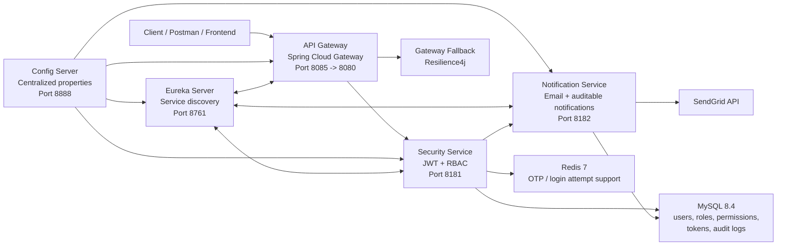
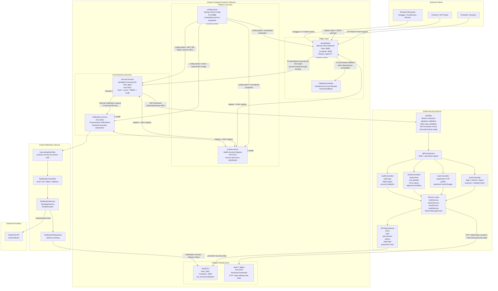

<div align="center">

# Production Prototype Security Template

### Java 21 | Spring Boot 3.4.5 | Spring Security 6 | JWT | RBAC | Microservices | Docker

[](#)
[](#)
[](#)
[](#)
[](#)

**A production-style backend security platform built to demonstrate enterprise Java engineering, secure system design, microservice architecture, and real-world ownership.**

[GitHub Profile](https://github.com/amarenderreddyvoladri) . [LinkedIn](https://linkedin.com/in/amarenderreddyvoladri)

</div>

---

## Recruiter Snapshot

This repository is a hands-on proof of backend engineering ability. It is not a small login tutorial. It is a multi-module Spring Boot security system with API Gateway routing, service discovery, centralized configuration, JWT access/refresh tokens, role-based and permission-based authorization, OTP flows, notification service isolation, Redis support, audit logging, Dockerized infrastructure, and integration-test coverage.

If you are hiring for **Java Backend Developer**, **Spring Boot Developer**, **Microservices Developer**, **Security-focused Backend Engineer**, or **Full Stack Developer with strong backend depth**, this project shows the exact skills usually tested in interviews and expected in production teams.

## What This Project Proves

| Hiring signal | Evidence in this repo |
|---|---|
| Modern Java backend development | Java 21, Spring Boot 3.4.5, Maven multi-module build |
| Security-first thinking | Spring Security 6, JWT, refresh-token rotation, DB token revocation, account lockout |
| Real authorization design | 7 seeded roles and 28 fine-grained permissions with method-level checks |
| Microservice architecture | API Gateway, Eureka Discovery Server, Config Server, Security Service, Notification Service |
| Production operations mindset | Docker Compose, health checks, Actuator, environment-based secrets, centralized config |
| Data and audit ownership | MySQL persistence, JPA auditing, audit query endpoints, write-focused service boundaries |
| Integration thinking | Notification facade/client, internal API key protection, SendGrid provider abstraction |
| Testing discipline | Spring Boot integration tests, H2/Testcontainers dependencies, security test support |

## Architecture At A Glance



## Full System Architecture Diagram

This is the complete current system view: how traffic enters, how services discover each other, where configuration comes from, where Redis and MySQL are used, how internal service communication is protected, and what Docker Compose runs locally.



### Communication Flow In One Look

| Flow | What happens |
|---|---|
| Client to system | Browser/Postman calls `api-gateway` on host port `8085`; gateway routes `/api/v1/**` to the registered security service |
| Gateway to services | Gateway uses Eureka service discovery with `lb://springboot-security-jwt-rbac-app1` and Resilience4j fallback support |
| Config loading | Services import centralized configuration from `config-server` and also receive secrets through `.env` / Docker environment variables |
| Service registry | Gateway, Security Service, and Notification Service register with Eureka and can discover each other by service name |
| Authentication | Login creates JWT access/refresh tokens; secured requests pass through `JwtFilter` before controllers execute |
| Authorization | Controller methods use `@PreAuthorize`; sensitive admin logic also validates permissions inside the service layer |
| Persistence | MySQL stores users, roles, permissions, token records, audit logs, password reset data, and notification records |
| Redis usage | Redis supports fast security state such as OTP and failed-login/account-protection flows |
| Internal service call | Security Service calls Notification Service using an internal API key, preventing public abuse of email endpoints |
| Email delivery | Notification Service stores notification state and delegates email delivery to SendGrid |
| Operations | Docker Compose starts MySQL, Redis, Config Server, Eureka, Notification Service, Security Service, and Gateway with health checks |

> Kafka note: Kafka is not currently implemented in this repository. The current notification communication is synchronous internal HTTP protected by an internal API key. Kafka can be added later for asynchronous events such as `USER_REGISTERED`, `OTP_REQUESTED`, `PASSWORD_CHANGED`, and `ACCOUNT_LOCKED`.

## Module Map

| Module | Responsibility | Key technologies |
|---|---|---|
| `api-gateway` | Single entry point, service-discovery routing, circuit-breaker fallback | Spring Cloud Gateway, Eureka Client, Resilience4j, Actuator |
| `config-server` | Centralized configuration source for services | Spring Cloud Config Server, Actuator |
| `eureka-server` | Service registry and discovery dashboard | Netflix Eureka Server, Actuator |
| `springboot-security-jwt-rbac-app4` | Main security domain: auth, users, roles, permissions, audits, tokens | Spring Security, JPA, Redis, JWT, OpenFeign/WebClient, Swagger |
| `notification-service` | Internal notification microservice with provider abstraction and delivery tracking | Spring Web, JPA, SendGrid, internal API key filter |
| root `pom.xml` | Aggregator build for all modules | Maven multi-module build |

## Core Security Capabilities

### Authentication and Token Lifecycle

- Stateless login with Spring Security `AuthenticationManager`.
- Access token and refresh token model using JJWT `0.11.5`.
- Stable JWT subject strategy using user identity instead of mutable email assumptions.
- Refresh token rotation with one-time-use semantics.
- Token reuse detection path that can revoke active sessions.
- Logout for current session and logout-all-devices flow.
- Session listing and individual session revocation endpoints.
- Database-backed token state, so logout and admin revocation are real, not cosmetic.

### Authorization and RBAC

- Seeded roles: `ADMIN`, `MANAGER`, `HR`, `EMPLOYEE`, `SUPPORT`, `USER`, `VENDOR`.
- Seeded permissions include user management, role assignment, approval workflow, audit access, security statistics, session revocation, and system administration permissions.
- `@EnableMethodSecurity` with `@PreAuthorize` checks at controller level.
- Service-layer permission validation for sensitive admin actions.
- Role and permission normalization before persistence.
- Token invalidation after important user changes such as disable, role update, and password change.

### Account Protection

- Brute-force login protection with configurable max attempts and lock duration.
- Redis-backed login attempt and OTP support in the main security service.
- OTP-based registration and password reset flows.
- OTP purpose separation to prevent cross-use between registration and password reset.
- Password change flow requiring current password and revoking existing sessions.
- Admin self-action guards for destructive operations.

### Audit and Observability

- Audit domain and audit query service for security-relevant events.
- Audit endpoints for logs, user history, failed logins, suspicious events, and statistics.
- Spring Boot Actuator health/info exposure.
- Gateway health and route visibility.
- Docker Compose health checks for infrastructure and services.

## API Surface

### Public and Auth APIs

| Method | Endpoint | Purpose |
|---|---|---|
| `POST` | `/api/v1/auth/login` | Login and issue JWT token pair |
| `POST` | `/api/v1/auth/refresh-token` | Rotate refresh token and issue a new access token |
| `POST` | `/api/v1/auth/validate-token` | Validate token signature, expiry, and server-side state |
| `POST` | `/api/v1/auth/logout` | Revoke current token pair |
| `POST` | `/api/v1/auth/logout-all` | Revoke all active sessions |
| `GET` | `/api/v1/auth/sessions` | List active sessions |
| `DELETE` | `/api/v1/auth/sessions/{id}` | Revoke one session |

### User APIs

| Method | Endpoint | Purpose |
|---|---|---|
| `GET` | `/api/v1/users` | List users with permission protection |
| `GET` | `/api/v1/users/me` | Current authenticated profile |
| `POST` | `/api/v1/users/send-registration-otp` | Send registration OTP |
| `POST` | `/api/v1/users/register` | Register after OTP verification |
| `POST` | `/api/v1/users/employee-register` | Submit employee registration for approval |
| `POST` | `/api/v1/users/forgot-password` | Request reset OTP without account enumeration |
| `POST` | `/api/v1/users/reset-password` | Reset password with valid OTP |
| `POST` | `/api/v1/users/change-password` | Change password and revoke sessions |

### Admin and Audit APIs

| Area | Representative endpoints |
|---|---|
| User control | `/api/v1/admin/users`, `/lock`, `/unlock`, `/enable`, `/disable`, `/force-logout`, `/revoke-tokens` |
| Approval workflow | `/api/v1/admin/pending-registrations`, `/registrations/{id}/approve`, `/registrations/{id}/reject` |
| System actions | `/api/v1/admin/system/maintenance-mode/enable`, `/cache/clear`, `/permissions/refresh` |
| Statistics | `/api/v1/admin/statistics/system`, `/api/v1/admin/statistics/security` |
| Audit | `/api/v1/admin/audit/logs`, `/users/{userId}`, `/security/failed-logins`, `/security/suspicious`, `/statistics` |

### Notification APIs

| Method | Endpoint | Purpose |
|---|---|---|
| `POST` | `/api/v1/notifications` | Send internal notification |
| `GET` | `/api/v1/notifications/{id}` | Fetch notification by ID |
| `GET` | `/api/v1/notifications` | List notifications |
| `GET` | `/api/v1/notifications/failed` | Inspect failed notifications |
| `GET` | `/api/v1/notifications/statistics` | Delivery statistics |
| `GET` | `/api/v1/notifications/health` | Notification service health |

## Technology Stack

| Category | Stack |
|---|---|
| Language | Java 21 |
| Framework | Spring Boot 3.4.5 |
| Cloud architecture | Spring Cloud 2024.0.1, Config Server, Eureka, Gateway |
| Security | Spring Security 6, JWT, method security, stateless sessions |
| Persistence | MySQL 8.4, Spring Data JPA, Hibernate |
| Cache / fast state | Redis 7 with Lettuce pooling |
| Communication | Spring Cloud OpenFeign, WebClient, internal API key |
| Email | SendGrid Java SDK |
| Documentation | SpringDoc OpenAPI / Swagger UI |
| Operations | Docker Compose, Actuator, health checks |
| Testing | JUnit 5, Spring Boot Test, Spring Security Test, H2, Testcontainers |

## Local Run

### Prerequisites

- Java 21+
- Maven 3.8+
- Docker Desktop or Docker Engine
- A `.env` file based on `.env.example`

### 1. Configure Environment

```bash
cp .env.example .env
```

Update the values:

```env
DB_USERNAME=root
DB_PASSWORD=change_me_strong_password
REDIS_PASSWORD=change_me_redis_password
JWT_SECRET=change_me_minimum_256_bit_secret_key_for_hs256_algorithm
INTERNAL_API_KEY=change_me_internal_api_key_min_32_chars
SENDGRID_API_KEY=SG.your_sendgrid_api_key
SENDGRID_SENDER_MAIL=you@yourdomain.com
SENDGRID_SENDER_NAME=YourAppName
```

### 2. Start the Full Platform

```bash
docker compose --env-file .env up --build
```

### 3. Open Services

| Service | URL |
|---|---|
| API Gateway | `http://localhost:8085` |
| Security Service | `http://localhost:8181` |
| Security Swagger UI | `http://localhost:8181/swagger-ui.html` |
| Notification Service | `http://localhost:8182` |
| Config Server | `http://localhost:8888` |
| Eureka Dashboard | `http://localhost:8761` |
| MySQL from host | `127.0.0.1:3307` |
| Redis from host | `localhost:6379` |

## Build and Test

Run all modules from the repository root:

```bash
mvn clean test
```

Run a single module:

```bash
mvn -pl springboot-security-jwt-rbac-app4 test
mvn -pl notification-service test
mvn -pl api-gateway test
```

## Project Structure

```text
production-prototype-security-template/
|-- api-gateway/
|   |-- src/main/java/.../ApiGatewayApplication.java
|   |-- src/main/java/.../FallbackController.java
|   `-- src/main/resources/application.properties
|-- config-server/
|   |-- src/main/java/.../ConfigServerApplication.java
|   `-- src/main/resources/config-repo/
|-- eureka-server/
|   |-- src/main/java/.../EurekaServerApplication.java
|   `-- src/main/java/.../monitoring/
|-- notification-service/
|   |-- controller/
|   |-- service/
|   |-- entity/
|   |-- filter/
|   `-- repo/
|-- springboot-security-jwt-rbac-app4/
|   |-- controller/
|   |-- service/
|   |-- security/
|   |-- filter/
|   |-- entity/
|   |-- repo/
|   |-- passwordreset/
|   |-- client/
|   `-- config/
|-- docker-compose.yml
|-- docker-compose.ci.yml
|-- .env.example
`-- pom.xml
```

## Engineering Decisions Worth Reviewing

| Decision | Why it matters |
|---|---|
| JWT plus DB-backed token state | Keeps stateless API performance while still supporting real logout, force logout, and revocation |
| Refresh token rotation | Reduces damage from leaked refresh tokens and enables replay detection |
| Permissions embedded into JWT | Fast authorization without DB lookup on every request |
| Service-layer permission checks | Protects sensitive operations even if routing or controller checks are changed |
| Separate notification service | Keeps email/provider concerns away from the security domain |
| Internal API key between services | Prevents public callers from abusing notification endpoints |
| Config Server and Eureka | Demonstrates production microservice patterns beyond a single monolith |
| Redis for fast security state | Supports OTP and login-attempt flows without overloading relational tables |
| Environment-driven secrets | Keeps deployable configuration outside source code |
| Docker health checks | Makes local startup closer to real operational readiness |

## For Technical Interviewers

Good places to review:

- `springboot-security-jwt-rbac-app4/src/main/java/.../config/SecurityConfig.java`
- `springboot-security-jwt-rbac-app4/src/main/java/.../filter/JwtFilter.java`
- `springboot-security-jwt-rbac-app4/src/main/java/.../service/AuthServiceImpl.java`
- `springboot-security-jwt-rbac-app4/src/main/java/.../service/AdminServiceImpl.java`
- `springboot-security-jwt-rbac-app4/src/main/java/.../security/RoleInitializationService.java`
- `notification-service/src/main/java/.../filter/InternalApiKeyFilter.java`
- `api-gateway/src/main/resources/application.properties`
- `docker-compose.yml`

These files show the real architecture: request filtering, token validation, authorization, role seeding, service-to-service protection, route discovery, and deployment wiring.

## Current Roadmap

- Add stronger CI visibility around module tests and Docker Compose smoke tests.
- Expand Testcontainers coverage for full MySQL and Redis security flows.
- Add OpenAPI examples for every auth and admin workflow.
- Add production profiles for stricter actuator exposure and secret handling.
- Add rate limiting at gateway and/or service layer.
- Add richer observability with structured logs and trace correlation IDs.

## About The Developer

**Amarender Reddy Voladri**  
Java Backend Developer | Spring Boot Developer | Security-Focused Engineer

I built this project to show that I can design, implement, debug, and explain a real backend security system end to end. The focus is not only on writing APIs, but on building the surrounding engineering discipline: security boundaries, token lifecycle, RBAC, auditability, microservice communication, deployment configuration, and maintainable project structure.

I am actively looking for opportunities where I can contribute as a Java/Spring Boot backend developer and grow with a serious engineering team.

<p align="center">
  <a href="https://linkedin.com/in/amarenderreddyvoladri">
    
  </a>
  <a href="https://github.com/amarenderreddyvoladri">
    
  </a>
</p>

---

<div align="center">

### If you are a recruiter, hiring manager, or senior developer reviewing this repo:

**This project is my practical proof of readiness for backend engineering work. I would be happy to discuss the architecture, tradeoffs, and implementation decisions in detail.**

</div>
