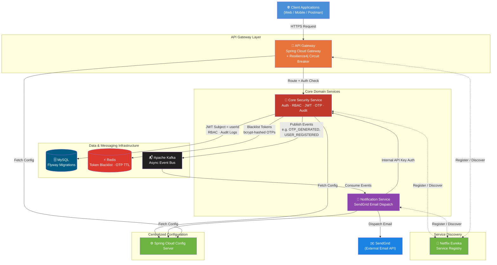
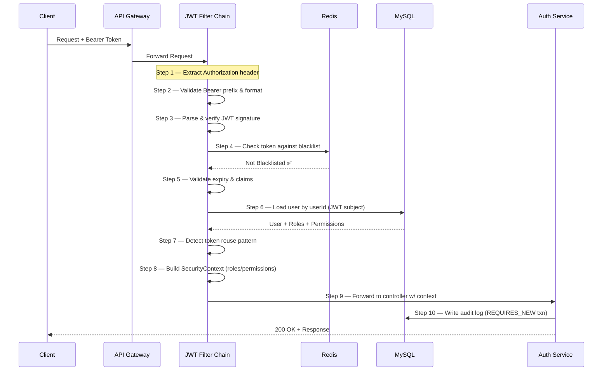
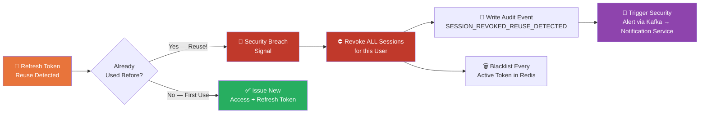
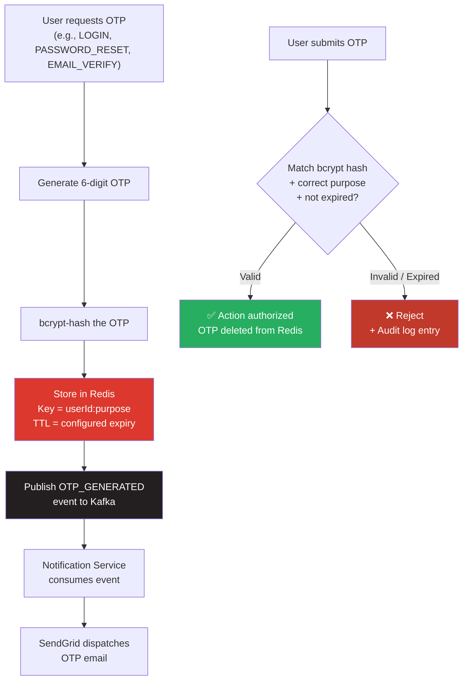
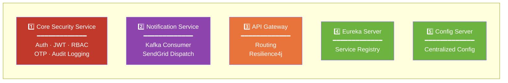
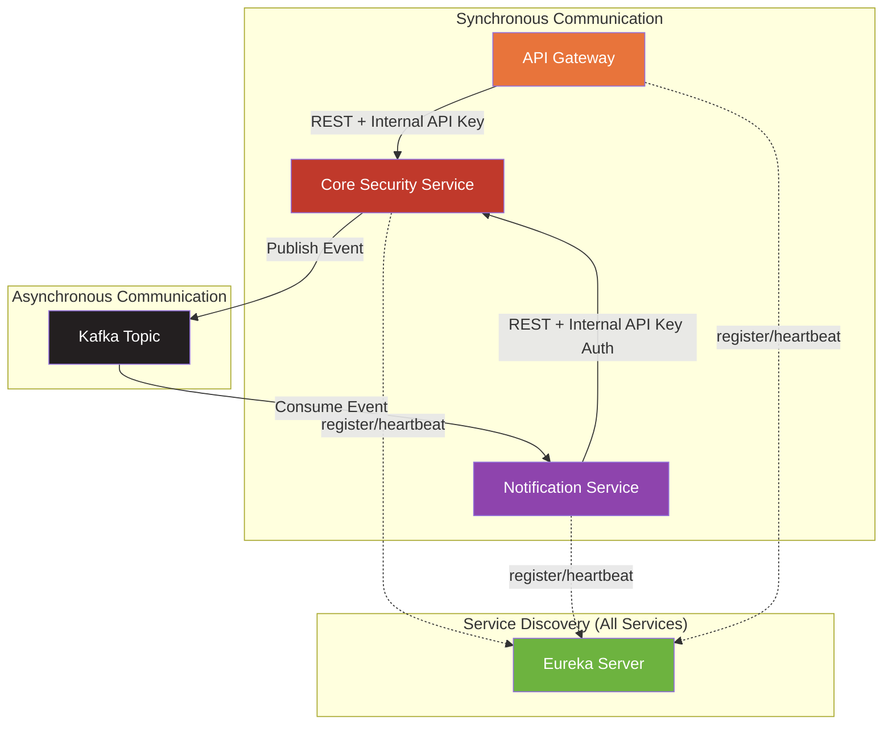

<div align="center">

# 🛡️ Production Prototype Security Template

### Enterprise-Grade Authentication & Authorization Microservices Platform

**JWT • RBAC • OTP • Redis • Kafka • API Gateway • Service Discovery • Centralized Config**

[](https://www.oracle.com/java/)
[](https://spring.io/projects/spring-boot)
[](https://spring.io/projects/spring-security)
[](https://redis.io/)
[](https://kafka.apache.org/)
[](https://www.mysql.com/)
[](https://www.docker.com/)
[](https://jwt.io/)

[](LICENSE)
[]()
[]()
[]()

**A real-world, production-style microservices security backbone — built the way a platform team would build the auth layer underneath an actual product.**

[Architecture](#-system-architecture) • [Tech Stack](#-technology-stack) • [Security Design](#-security-engineering-deep-dive) • [Services](#-microservices-breakdown) • [API Reference](#-api-reference) • [Setup](#-getting-started) • [Engineering Decisions](#-key-engineering-decisions--why-they-matter)

</div>

---

## 📌 What This Project Actually Is

Most "auth project" repos on GitHub are a single Spring Boot app with a login endpoint and a JWT filter bolted on. **This is not that.**

This is a **distributed, multi-service security platform** — the kind of system a dedicated platform/identity team builds *underneath* a real product, so every other microservice in the company can authenticate, authorize, and audit users without reinventing security logic. It was built to mirror how authentication, authorization, and notification concerns are decomposed and isolated in production-grade systems at scale.

> 💡 **The core idea:** Security shouldn't live inside your business logic. It should be a standalone, horizontally scalable, independently deployable platform that every other service trusts and talks to.

This repository demonstrates that philosophy end-to-end — from the JWT filter chain, to Redis-backed token revocation, to Kafka-driven async notifications, to a full audit trail that's tamper-resistant by design.

---

## 🏗️ System Architecture

### High-Level Service Topology



### Request Lifecycle — The 9-Step JWT Filter Chain

Every authenticated request to the Core Security Service flows through a deliberately ordered filter chain — order matters, and each step exists to close a specific class of vulnerability.



### Token Reuse Detection & Session Revocation Flow



### OTP Lifecycle (Redis-Backed, Purpose-Isolated)



---

## 🧰 Technology Stack

<table>
<tr>
<th>Layer</th>
<th>Technology</th>
<th>Why It's Here</th>
</tr>

<tr>
<td><b>Language & Runtime</b></td>
<td>Java 17, Spring Boot 3.x</td>
<td>Modern Spring Boot 3 baseline with Jakarta namespace, virtual-thread-ready runtime</td>
</tr>

<tr>
<td><b>Security</b></td>
<td>Spring Security 6, JWT (JJWT), RBAC</td>
<td>Stateless authentication with claims-based authorization across 5 roles and 22+ granular permissions</td>
</tr>

<tr>
<td><b>API Gateway</b></td>
<td>Spring Cloud Gateway, Resilience4j</td>
<td>Single entry point, dynamic routing, and circuit-breaking to prevent cascading failures across services</td>
</tr>

<tr>
<td><b>Service Discovery</b></td>
<td>Netflix Eureka</td>
<td>Dynamic service registration so the Gateway never hardcodes service locations</td>
</tr>

<tr>
<td><b>Centralized Config</b></td>
<td>Spring Cloud Config Server</td>
<td>Externalized, environment-aware configuration shared across every microservice</td>
</tr>

<tr>
<td><b>Caching & Ephemeral State</b></td>
<td>Redis</td>
<td>Token blacklist for instant revocation, OTP storage with native TTL expiry — no cron cleanup jobs needed</td>
</tr>

<tr>
<td><b>Messaging / Event Bus</b></td>
<td>Apache Kafka</td>
<td>Decouples the auth service from the notification service — auth never blocks on email delivery</td>
</tr>

<tr>
<td><b>Persistence</b></td>
<td>MySQL, Flyway</td>
<td>Versioned, repeatable schema migrations — no manual SQL scripts, no schema drift between environments</td>
</tr>

<tr>
<td><b>Transactional Email</b></td>
<td>SendGrid</td>
<td>Reliable transactional email delivery for OTPs, alerts, and account notifications</td>
</tr>

<tr>
<td><b>Containerization</b></td>
<td>Docker, Docker Compose</td>
<td>One-command spin-up of the entire 5-service distributed system, locally or in CI</td>
</tr>

<tr>
<td><b>Resilience</b></td>
<td>Resilience4j</td>
<td>Circuit breakers and retries at the Gateway so one struggling downstream service can't take down the whole platform</td>
</tr>

</table>

---

## 🧩 Microservices Breakdown



| # | Service | Core Responsibility | Key Tech |
|---|---------|---------------------|----------|
| 1 | **Core Security Service** | User auth, registration, JWT issuance/validation, RBAC enforcement, OTP generation/verification, write-once audit logging | Spring Security 6, JWT, Redis, MySQL |
| 2 | **Notification Service** | Consumes Kafka events, sends transactional emails via SendGrid, authenticated via internal API key | Kafka Consumer, SendGrid, Eureka Client |
| 3 | **API Gateway** | Single entry point for all client traffic, dynamic request routing, circuit breaking | Spring Cloud Gateway, Resilience4j |
| 4 | **Eureka Server** | Service registry — every service self-registers and discovers peers dynamically | Netflix Eureka |
| 5 | **Config Server** | Single source of truth for configuration across all environments | Spring Cloud Config |

---

## 🔐 Security Engineering Deep Dive

This is the section that separates a tutorial project from a production-minded one. Every decision below was made deliberately, with a specific failure mode in mind.

### 🎯 JWT Subject = `userId`, Not Email

> Emails change. User IDs don't. Using a mutable field as the cryptographic subject of a token is a subtle but real production bug — this system avoids it from day one by using the immutable internal `userId` as the JWT subject claim.

### 🎯 Write-Once Audit Logging in `REQUIRES_NEW` Transactions

> Audit logs are written in a **separate, independent transaction** (`@Transactional(propagation = Propagation.REQUIRES_NEW)`) so that even if the parent business transaction rolls back, the audit trail survives. **40+ distinct audit event types** are tracked — covering everything from login attempts to permission changes to token revocations — making the system forensically traceable.

### 🎯 Token Reuse Detection with Full Session Revocation

> Refresh token rotation is implemented with reuse detection: if a previously-used refresh token is ever presented again, it's treated as a signal of token theft, and **every active session for that user is revoked immediately** — not just the compromised token.

### 🎯 Redis-Backed, bcrypt-Hashed OTPs with Purpose Isolation

> OTPs are never stored in plaintext — they're bcrypt-hashed before being cached in Redis. Each OTP is scoped to a specific **purpose** (login, password reset, email verification), so an OTP issued for one flow can never be replayed against another.

### 🎯 The 9-Step JWT Filter Chain

> Rather than a single monolithic filter, request authentication is broken into nine discrete, independently testable steps — extraction, format validation, signature verification, blacklist check, expiry/claims validation, user resolution, reuse detection, security context construction, and forwarding. Each step fails fast and fails loud.

### 🎯 RBAC at Real Granularity

> Role-based access control here isn't a toy `ADMIN` / `USER` switch. The system models:

| Dimension | Scope |
|---|---|
| **Roles** | 5 distinct roles |
| **Permissions** | 22+ granular, independently assignable permissions |
| **Microservices Enforcing RBAC** | 5 services, consistently |
| **Audit Event Types Tracked** | 40+ distinct event categories |

---

## 🔄 Internal Service Communication



Inter-service calls are authenticated with an **internal API key**, separate from end-user JWTs — meaning even if a service-to-service call is intercepted, it cannot be replayed as a user-facing credential, and vice versa. The Notification Service was specifically hardened to register with Eureka and authenticate every inbound call from the Core Security Service through this internal key mechanism.

---

## 📡 API Reference

> Full endpoint-level documentation lives in the codebase. High-level surface area:

| Category | Example Endpoints | Auth Required |
|---|---|---|
| **Authentication** | `POST /api/auth/register`, `POST /api/auth/login`, `POST /api/auth/refresh` | No (login/register) |
| **OTP** | `POST /api/otp/generate`, `POST /api/otp/verify` | Varies by purpose |
| **User & RBAC** | `GET /api/users/{id}`, `PUT /api/users/{id}/roles` | JWT + Permission Check |
| **Session Management** | `POST /api/auth/logout`, `POST /api/auth/revoke-all` | JWT |
| **Audit** | `GET /api/audit/logs` | JWT + Admin Permission |
| **Notifications (Internal)** | `POST /internal/notify/email` | Internal API Key |

---

## 🛠️ Key Engineering Decisions — Why They Matter

| Decision | Naive Alternative | Why This Approach Wins |
|---|---|---|
| Redis token blacklist | DB-backed revocation table | Sub-millisecond lookups, native TTL — no cleanup jobs |
| Kafka for notifications | Direct synchronous REST call | Auth service never blocks waiting on SendGrid |
| `userId` as JWT subject | Email as JWT subject | Immutable identity — survives email changes |
| `REQUIRES_NEW` audit transactions | Audit log in same transaction | Audit trail survives even on business-logic rollback |
| Internal API key for service calls | Reusing user JWTs internally | Clean credential separation between user-facing and service-facing auth |
| Config Server | `.env` files per service | One source of truth, environment-aware, no config drift |
| Eureka service discovery | Hardcoded service URLs | Services scale up/down without redeploying the Gateway |

---

## 🐛 Production Hardening — 18+ Real Bugs Found & Fixed

This wasn't built once and left untouched — it went through multiple rounds of real debugging that mirror actual production incidents:

- 🔧 Resolved a **method signature mismatch** between `NotificationClient` and its callers
- 🔧 Added **internal API key authentication** to the Notification Service
- 🔧 Fixed **missing Eureka registration** in the Notification Service
- 🔧 Corrected an **unstable SNAPSHOT dependency** that broke reproducible builds
- 🔧 Added missing configuration properties causing silent startup failures
- 🔧 ...and 13+ additional fixes spanning serialization, transaction boundaries, and security filter ordering

---

## 🚀 Getting Started

```bash
# Clone the repository
git clone https://github.com/amarenderreddyvoladri/production-prototype-security-template.git
cd production-prototype-security-template

# Spin up the entire 5-service distributed system
docker-compose up --build

# Services will register with Eureka automatically.
# Eureka Dashboard:        http://localhost:8761
# API Gateway entrypoint:  http://localhost:8080
```

**Prerequisites:** Java 17+, Docker & Docker Compose, Maven

---

## 👤 About the Engineer

**Amarender Reddy Voladri**
Java Backend Developer | Spring Boot · Microservices · Distributed Systems Security

This project was built as a hands-on deep dive into how real platform teams architect identity and authorization infrastructure — not as a tutorial clone, but as a system designed, broken, debugged, and hardened the way production software actually gets built.

[](https://github.com/amarenderreddyvoladri)
[](https://amarenderreddyvoladri-portfolio.netlify.app)
[](https://linkedin.com/in/amarender-reddy-voladri)

---

<div align="center">

**⭐ If this architecture was useful as a reference for your own backend system design, consider starring the repo.**

</div>
