<div align="center">

# 🛡️ Production Prototype Security Template

### A High-Performance, Distributed Identity & Access Management (IAM) Platform — Architected Microservice by Microservice

**Spring Boot 3.3+ · Spring Security 6.3+ · JJWT (Java JWT) · RBAC · Redis Cache · Resilience4j · Netflix Eureka · Config Server · Docker Compose · GitHub Actions CI/CD**

[](https://www.oracle.com/java/)
[](https://spring.io/projects/spring-boot)
[](https://spring.io/projects/spring-security)
[](https://redis.io/)
[](https://www.mysql.com/)
[](https://www.docker.com/)
[](https://github.com/features/actions)
[-000000?style=for-the-badge&logo=jsonwebtokens&logoColor=white)](https://jwt.io/)

[]()
[]()
[]()
[]()
[]()
[]()

**A production-ready, self-contained identity platform comprised of five independently deployable Spring Boot services. Together, they handle stateless JWT-based authentication, granular permission-based RBAC, multi-purpose Redis-backed OTP verification, session lifecycle control, email delivery tracking, and transactional security auditing.**

[Philosophy & Motto](#-philosophy--project-motto) • [System Architecture](#-system-architecture) • [Security Engineering](#-security-engineering--what-makes-this-production-grade) • [Microservices Breakdown](#-microservices-breakdown) • [Recent Hardening Updates](#-recent-hardening--performance-updates) • [RBAC & Endpoint Map](#-rbac--api-surface) • [Setup & Running](#-installation--running-locally) • [Kubernetes & Cloud Roadmap](#-kubernetes--platform-evolution-roadmap)

</div>

---

## 📌 Philosophy & Project Motto

In modern web development, authentication and authorization are too often treated as afterthoughts—bolted onto a single monolith or duplicated across multiple business logic applications. 

> 🎯 **The Project Motto:** *Identity should be a platform, not business logic.*

This template is built on the engineering principle that authentication, authorization, token rotation, audit tracking, and security notifications must live in a dedicated, isolated platform layer. Any product or downstream business service should be able to delegate trust to this platform, querying it through a secure gateway, and relying on its write-once security auditing. 

By separating security concerns from the business domain:
* **Security audits** are centralized and cannot be bypassed by bugs in business services.
* **Cryptographic secrets** are stored in a single place rather than distributed across the company.
* **Authentication mechanisms** (like moving from username/password to OTP or SSO) can be upgraded without modifying downstream business applications.

---

## 🏗️ System Architecture

### Distributed Platform Topology

The following diagram illustrates the deployment topology of the five Spring Boot services, database infrastructure, caching layers, and communication boundaries:

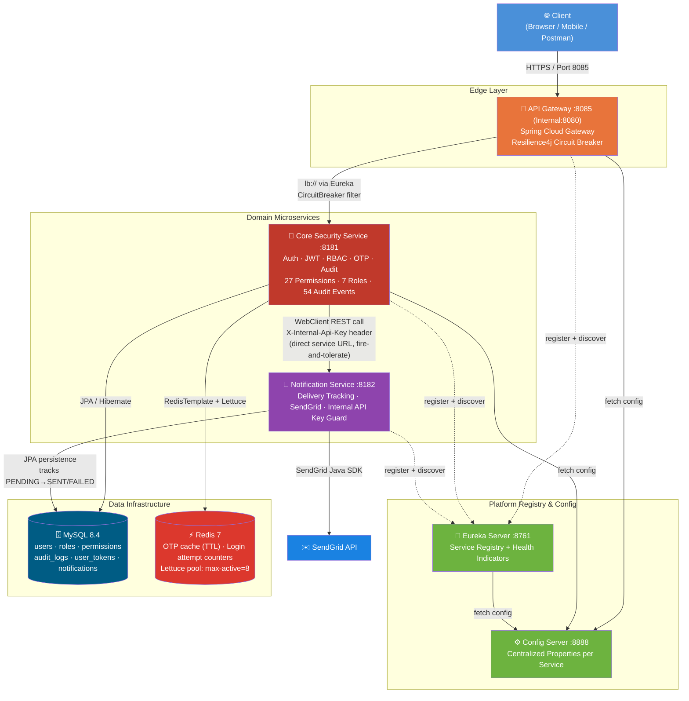
```mermaid
graph TB
    Client["🌐 Client<br/>(Browser / Mobile / Postman)"]

    subgraph Edge["Edge Layer"]
        GW["🚪 API Gateway :8085 (Internal:8080)<br/>Spring Cloud Gateway<br/>Resilience4j Circuit Breaker"]
    end

    subgraph Platform["Platform Registry & Config"]
        EUREKA["📡 Eureka Server :8761<br/>Service Registry + Health Indicators"]
        CONFIG["⚙️ Config Server :8888<br/>Centralized Properties per Service"]
    end

    subgraph Core["Domain Microservices"]
        AUTH["🔐 Core Security Service :8181<br/>Auth · JWT · RBAC · OTP · Audit<br/>27 Permissions · 7 Roles · 54 Audit Events"]
        NOTIF["📨 Notification Service :8182<br/>Delivery Tracking · SendGrid · Internal API Key Guard"]
    end

    subgraph Data["Data Infrastructure"]
        MYSQL[("🗄️ MySQL 8.4<br/>users · roles · permissions<br/>audit_logs · user_tokens · notifications")]
        REDIS[("⚡ Redis 7<br/>OTP cache (TTL) · Login attempt counters<br/>Lettuce pool: max-active=8")]
    end

    SENDGRID["✉️ SendGrid API"]

    Client -->|HTTPS / Port 8085| GW
    GW -->|"lb:// via Eureka<br/>CircuitBreaker filter"| AUTH
    GW -.->|register + discover| EUREKA
    AUTH -.->|register + discover| EUREKA
    NOTIF -.->|register + discover| EUREKA

    GW -->|fetch config| CONFIG
    AUTH -->|fetch config| CONFIG
    EUREKA -->|fetch config| CONFIG

    AUTH -->|JPA / Hibernate| MYSQL
    AUTH -->|RedisTemplate + Lettuce| REDIS
    AUTH -->|"WebClient REST call<br/>X-Internal-Api-Key header<br/>(direct service URL, fire-and-tolerate)"| NOTIF

    NOTIF -->|JPA persistence<br/>tracks PENDING→SENT/FAILED| MYSQL
    NOTIF -->|"SendGrid Java SDK"| SENDGRID

    style Client fill:#4A90D9,color:#fff
    style GW fill:#E8743B,color:#fff
    style EUREKA fill:#6DB33F,color:#fff
    style CONFIG fill:#6DB33F,color:#fff
    style AUTH fill:#C0392B,color:#fff
    style NOTIF fill:#8E44AD,color:#fff
    style MYSQL fill:#005C84,color:#fff
    style REDIS fill:#DC382D,color:#fff
    style SENDGRID fill:#1A82E2,color:#fff
```

> ⚠️ **Inter-Service Communication Detail:** The Core Security Service invokes the Notification Service via a non-blocking Spring `WebClient` call. Calls are secured with a custom `X-Internal-Api-Key` header and execute in a **"fire-and-tolerate"** design. If a downstream notification provider (e.g., SendGrid) experiences an outage, the exception is caught, logged, and audited, but **never rolls back the parent user transaction** (such as registration or password resets).

---

### The 9-Step JWT Authentication Filter Chain (`JwtFilter.java`)

Every request targetting a secured endpoint passes through this precise filter chain in the Core Security Service:

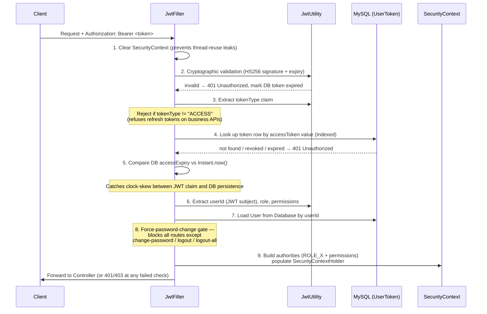
```mermaid
sequenceDiagram
    participant C as Client
    participant F as JwtFilter
    participant U as JwtUtility
    participant DB as MySQL (UserToken)
    participant SC as SecurityContext

    C->>F: Request + Authorization: Bearer <token>
    F->>F: 1. Clear SecurityContext (prevents thread-reuse leaks)
    F->>U: 2. Cryptographic validation (HS256 signature + expiry)
    U-->>F: invalid → 401 Unauthorized, mark DB token expired

    F->>U: 3. Extract tokenType claim
    Note over F: Reject if tokenType != "ACCESS"<br/>(refuses refresh tokens on business APIs)

    F->>DB: 4. Look up token row by accessToken value (Indexed)
    DB-->>F: not found / revoked / expired → 401 Unauthorized

    F->>F: 5. Compare DB accessExpiry vs Instant.now()
    Note over F: Catches clock-skew between JWT claim and DB persistence

    F->>U: 6. Extract userId (JWT subject), role, permissions
    F->>DB: 7. Load User from Database by userId
    Note over F: 8. Force-password-change gate —<br/>blocks all routes except<br/>change-password / logout / logout-all

    F->>SC: 9. Build authorities (ROLE_X + permissions)<br/>populate SecurityContextHolder
    F->>C: Forward to Controller (or 401/403 at any failed check)
```

---

## 🔐 Security Engineering — What Makes This Production-Grade

Rather than adopting a simple security checklist, this template is built with specific defense-in-depth mechanisms:

### 1. Cryptographic Signature Hardening
Instead of relying on deprecated JJWT builders, the `JwtUtility` class utilizes modern signing mechanisms. It generates HMAC-SHA keys via `Keys.hmacShaKeyFor(secret.getBytes())` and enforces secret complexity rules at bootstrap (throwing initialization exceptions if the secret key is under 256 bits or matches common defaults).

### 2. Refresh Token Rotation (RTR) with Reuse-Attack Detection
When a user requests a new token pair, the system invalidates the previous refresh token. If a client attempts to present an **already-used refresh token**, the platform flags this as a replay attack (`TOKEN_REUSE_ATTACK` warning), immediately revokes all active tokens for that user ID, and terminates all active sessions to neutralize the threat:

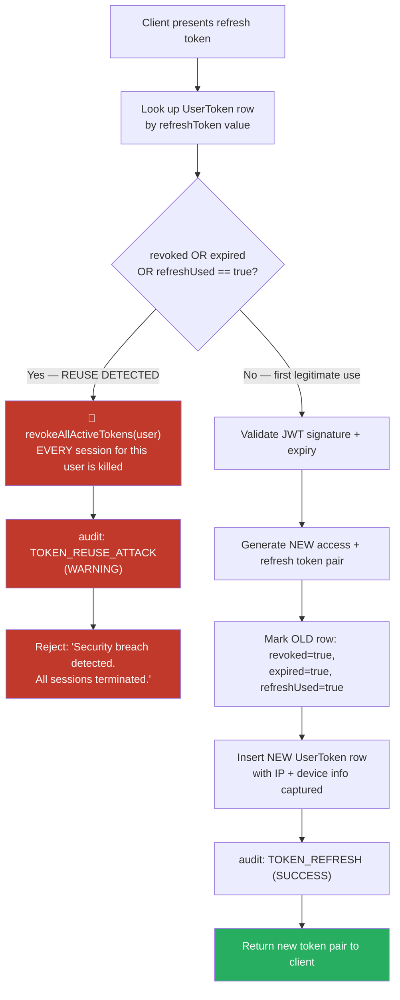
```mermaid
flowchart TD
    A["Client presents refresh token"] --> B["Look up UserToken row<br/>by refreshToken value"]
    B --> C{"revoked OR expired<br/>OR refreshUsed == true?"}
    C -->|"Yes — REUSE DETECTED"| D["🚨 revokeAllActiveTokens(user)<br/>EVERY session for this user is killed"]
    D --> E["audit: TOKEN_REUSE_ATTACK<br/>(WARNING)"]
    E --> F["Reject: 'Security breach detected.<br/>All sessions terminated.'"]

    C -->|"No — first legitimate use"| G["Validate JWT signature + expiry"]
    G --> H["Generate NEW access + refresh token pair"]
    H --> I["Mark OLD row: revoked=true,<br/>expired=true, refreshUsed=true"]
    I --> J["Insert NEW UserToken row<br/>with IP + device info captured"]
    J --> K["audit: TOKEN_REFRESH (SUCCESS)"]
    K --> L["Return new token pair to client"]

    style D fill:#C0392B,color:#fff
    style E fill:#C0392B,color:#fff
    style F fill:#C0392B,color:#fff
    style L fill:#27AE60,color:#fff
```

### 3. Purpose-Isolated, BCrypt-Hashed OTPs
OTPs are stored in Redis as BCrypt hashes (never in plaintext). They are isolated via prefix namespaces in the format `otp:{purpose}:{email}` with a 5-minute TTL. This prevents an OTP issued for email verification from being replayed for password resets.

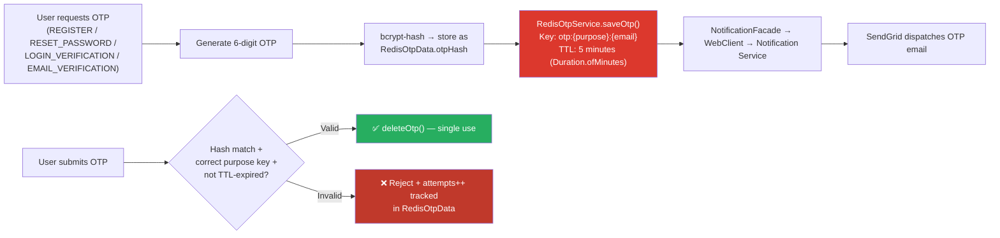
```mermaid
flowchart LR
    A["User requests OTP<br/>(REGISTER / RESET_PASSWORD /<br/>LOGIN_VERIFICATION / EMAIL_VERIFICATION)"] --> B["Generate 6-digit OTP"]
    B --> C["bcrypt-hash → store as<br/>RedisOtpData.otpHash"]
    C --> D["RedisOtpService.saveOtp()<br/>Key: otp:{purpose}:{email}<br/>TTL: 5 minutes (Duration.ofMinutes)"]
    D --> E["NotificationFacade → WebClient → Notification Service"]
    E --> F["SendGrid dispatches OTP email"]

    G["User submits OTP"] --> H{"Hash match +<br/>correct purpose key +<br/>not TTL-expired?"}
    H -->|Valid| I["✅ deleteOtp() — single use"]
    H -->|Invalid| J["❌ Reject + attempts++ tracked<br/>in RedisOtpData"]

    style D fill:#DC382D,color:#fff
    style I fill:#27AE60,color:#fff
    style J fill:#C0392B,color:#fff
```

### 4. Hybrid Account Lockout (Brute-Force Protection)
Login attempts are tracked in Redis. Upon reaching 5 consecutive failures, the lockout state is durable; it is persisted to the database on the `User` entity, while the fast-expiring count in Redis resets. This ensures that even if Redis is flushed, brute-force locks remain active.

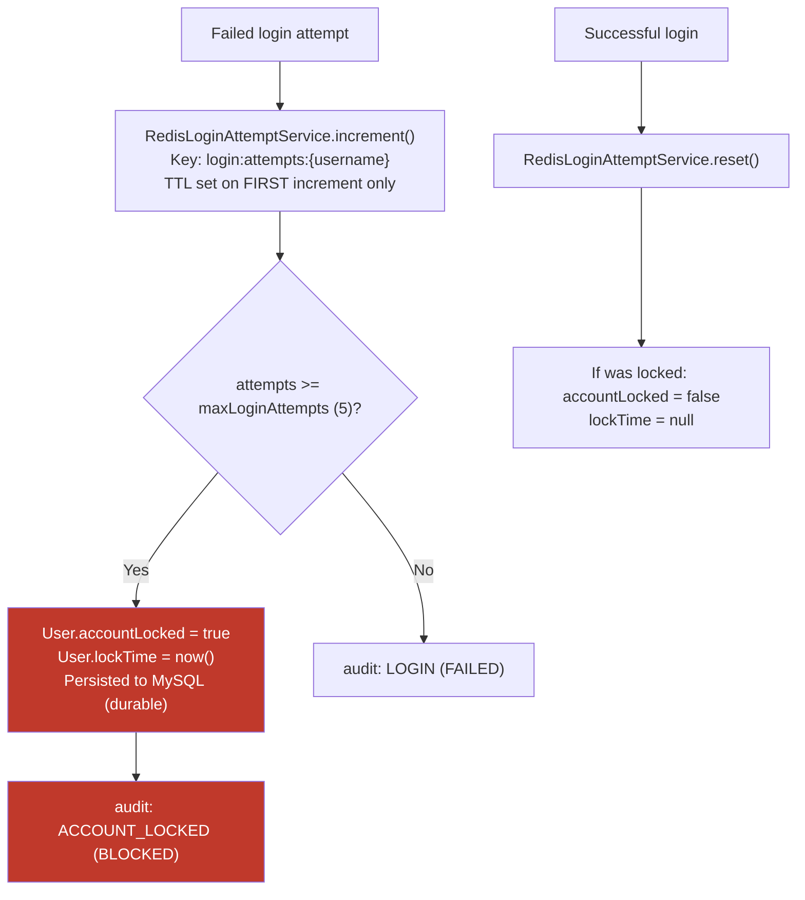
```mermaid
flowchart TD
    A["Failed login attempt"] --> B["RedisLoginAttemptService.increment()<br/>Key: login:attempts:{username}<br/>TTL set on FIRST increment only"]
    B --> C{"attempts >= maxLoginAttempts (5)?"}
    C -->|Yes| D["User.accountLocked = true<br/>User.lockTime = now()<br/>Persisted to MySQL (durable)"]
    D --> E["audit: ACCOUNT_LOCKED (BLOCKED)"]
    C -->|No| F["audit: LOGIN (FAILED)"]

    G["Successful login"] --> H["RedisLoginAttemptService.reset()"]
    H --> I["If was locked: accountLocked = false<br/>lockTime = null"]

    style D fill:#C0392B,color:#fff
    style E fill:#C0392B,color:#fff
```

### 5. Write-Once, Fault-Isolated Auditing
Audit events are written inside a separate database transaction (`@Transactional(propagation = Propagation.REQUIRES_NEW)`). If an database write to the audit log fails, the exception is caught and logged, but never interrupts the primary authentication transaction.

---

## 🧩 Microservices Breakdown

The platform is decomposed into five specialized microservices:

### 1️⃣ Core Security Service (`springboot-security-jwt-rbac-app4`)
* **Role:** Serves as the identity provider, session keeper, and OTP controller.
* **Stateless Filter Chain:** Implements authentication via Spring Security 6's filter chain.
* **Employee Registration & Admin Approvals:** Implements user states (`PENDING_APPROVAL`, `ACTIVE`, `BLOCKED`). Employees sign up for specific roles, which are approved/rejected by users possessing approval privileges.
* **Single-Active Session Policy:** Forces old tokens to revoke upon new logins, allowing easy configuration of concurrent logins.
* **Force Password Change:** If `forcePasswordChange` is true, the security filter blocks access to all APIs except `/change-password` and logout routes.

### 2️⃣ Notification Service (`notification-service`)
* **Role:** Manages email formatting and transaction logging.
* **Delivery Logging:** Persists every notification row as `PENDING`, changing it to `SENT` or `FAILED` (recording the error trace) once SendGrid completes the delivery.
* **timing Attack Prevention:** Validates incoming requests using constant-time checks (`MessageDigest.isEqual()`) on the `X-Internal-Api-Key` header.
* **Pluggable Mail Structure:** Decoupled behind the `EmailProvider` interface, allowing SendGrid to be swapped for AWS SES or SMTP without codebase-wide updates.

### 3️⃣ API Gateway (`api-gateway`)
* **Role:** Single point of entry. It routes incoming traffic to appropriate services via Eureka load-balancing (`lb://`).
* **Resilience:** Integrates Resilience4j circuit breakers on security routes, redirecting un-routable requests to a fallback controller which returns a clean `503 Service Unavailable`.
* **Path Exclusions:** Configured to expose `/swagger-ui.html` and `/v3/api-docs` directly from target services while protecting core controllers.

### 4️⃣ Eureka Server (`eureka-server`)
* **Role:** Dynamic service discovery.
* **Custom Health:** Implements `DiscoveryServerHealthIndicator` to return detailed service registry status.
* **Self-Preservation:** Enabled to prevent false-positive service de-registrations during transient network drops.

### 5️⃣ Config Server (`config-server`)
* **Role:** Centralized configuration management.
* **Configuration Repository:** Reads from a local `config-repo` directory, enabling centralized, environment-specific property files for all microservices.

---

## 🚀 Recent Hardening & Performance Updates

This repository undergoes continuous security and performance refinement. The following modifications are integrated into the current version:

### 1. Modernized Token Security (`JwtUtility.java`)
* Removed deprecated `SignatureAlgorithm` usage in token signing.
* Validated cryptographic secret strength on startup: throws `IllegalArgumentException` if the `jwt.secret` is shorter than 256 bits (32 characters) or matches generic words like `secret`, `password`, or `changeme`.

### 2. Strict OTP Validation Sequence
* Refactored OTP check logic in `UserServiceImpl.java`. The system now executes validations in a strict order:
  1. Check if OTP verification attempts exceed the block limit (5 attempts).
  2. Match OTP purpose key (e.g., `REGISTER`, `RESET_PASSWORD`).
  3. Verify token expiration timeline.
  4. Compare the BCrypt hash.
* This order ensures that expired or mismatched purpose OTP tokens do not incorrectly increment validation attempt counts.

### 3. High-Throughput Database Indexes (`user_tokens`)
* Added database indexes on the columns `accessToken`, `refreshToken`, and `user_id` inside the `user_tokens` table.
* This optimizes the execution plan for the `JwtFilter`, replacing costly full-table scans with index seek lookups on high-concurrency requests.

### 4. Admin Unlock & Redis State Sync
* Realigned the user unlock flow in `AdminController`. Whenever an administrator unlocks a blocked account, the login attempt counter in Redis is immediately purged.
* This prevents immediate lock re-triggers due to cached failed login counts.

### 5. Forgot Password OTP Invalidation
* Requesting a new password reset OTP now automatically invalidates any active password reset OTPs generated previously for that user email.

---

## 🧰 Technology Stack Overview

Below is the verified technology stack matching the root `pom.xml` reactor and service dependency files:

| Layer | Component | Implementation / Details |
|---|---|---|
| **Build & Language** | Java 21, Maven | Multi-module Maven reactor managed via a parent POM. |
| **Security Framework** | Spring Security 6.3 | Stateless filter chain, Method security (`@PreAuthorize`), custom authentication providers. |
| **Token Handling** | JJWT (Java JWT) | HS256 HMAC tokens. Custom expiry validations. |
| **Caching & OTPs** | Spring Data Redis (Lettuce) | Connection pool configured (max-active=8, max-idle=4). Hashed OTP values. |
| **Database** | Hibernate / JPA, MySQL 8.4 | Optimized schema generation with explicit database indexes for queries. |
| **Resilience & Edge** | Spring Cloud Gateway, Resilience4j | Circuit breaker routing, fallbacks, and microservice discovery routing. |
| **Discovery** | Netflix Eureka Server/Client | Dynamic discovery registration with healthcheck monitoring. |
| **Logging** | SLF4J, Logback | Structured JSON logs using a standardized format for ELK/Loki log parsers. |
| **Integration Testing** | Testcontainers, JUnit 5 | Spins up real Dockerized MySQL and Redis instances during local and CI test phases. |

---

## 🔐 RBAC & API Surface

### The Granular Permission Hierarchy

The platform seeds **27 permissions** across **7 roles** out of the box (managed inside `RoleInitializationService.java`):


```mermaid
graph TD
    ADMIN["ADMIN<br/>27 Permissions"]
    MANAGER["MANAGER<br/>11 Permissions"]
    HR["HR<br/>2 Permissions"]
    SUPPORT["SUPPORT<br/>2 Permissions"]
    EMPLOYEE["EMPLOYEE<br/>1 Permission"]
    USER["USER<br/>1 Permission"]
    VENDOR["VENDOR<br/>0 Permissions"]

    style ADMIN fill:#C0392B,color:#fff
    style MANAGER fill:#E8743B,color:#fff
    style HR fill:#6DB33F,color:#fff
    style SUPPORT fill:#6DB33F,color:#fff
    style EMPLOYEE fill:#3498DB,color:#fff
    style USER fill:#3498DB,color:#fff
    style VENDOR fill:#95A5A6,color:#fff
```

* **USER / EMPLOYEE:** Limited to self profile access (`VIEW_PROFILE`).
* **HR / SUPPORT:** Permitted to query users (`VIEW_USERS`) but cannot perform mutations.
* **MANAGER:** Possesses read permissions along with registration approvals (`VIEW_PENDING_REGISTRATIONS`, `APPROVE_REGISTRATION`).
* **ADMIN:** Complete control of the security realm, including account locking, token revocation, system maintenance mode, cache purges, and log streams.

---

### Endpoint Matrix

All paths are routed through the Gateway (Port `8085` externally, forwarding to port `8080`).

| Controller | HTTP Path | Method | Minimum Privilege | Description |
|---|---|---|---|---|
| `AuthController` | `/api/v1/auth/login` | POST | Public | Authenticates credentials and returns JWT pair. |
| `AuthController` | `/api/v1/auth/refresh-token` | POST | Public | Rotates Access Token; detects reuse. |
| `AuthController` | `/api/v1/auth/validate-token` | POST | Public | Checks cryptographic validation of an access token. |
| `AuthController` | `/api/v1/auth/logout` | POST | Authenticated | Invalidates the active access token. |
| `AuthController` | `/api/v1/auth/logout-all` | POST | Authenticated | Revokes all active tokens for the user ID. |
| `AuthController` | `/api/v1/auth/sessions` | GET | Authenticated | Returns a list of active login sessions. |
| `AuthController` | `/api/v1/auth/sessions/{id}` | DELETE | Authenticated | Revokes a specific active session. |
| `UserController` | `/api/v1/users/register` | POST | Public | Standard signup (requires a valid registration OTP). |
| `UserController` | `/api/v1/users/employee-register` | POST | Public | Employee signup; puts user in `PENDING_APPROVAL`. |
| `UserController` | `/api/v1/users/forgot-password` | POST | Public | Sends a password reset OTP. |
| `UserController` | `/api/v1/users/reset-password` | POST | Public | Consumes reset OTP and updates password. |
| `UserController` | `/api/v1/users/change-password` | POST | Authenticated | Updates password; clears force-password flag. |
| `UserController` | `/api/v1/users/me` | GET | Authenticated | Retrieves profile of currently authenticated user. |
| `UserController` | `/api/v1/users` | GET | `VIEW_USERS` | Lists all users in the system. |
| `AdminController` | `/api/v1/admin/users/{id}/force-logout` | POST | `FORCE_LOGOUT` | Forces a user logout by revoking their tokens. |
| `AdminController` | `/api/v1/admin/users/{id}/revoke-tokens` | POST | `REVOKE_TOKEN` | Invalidates active user tokens. |
| `AdminController` | `/api/v1/admin/users/{id}/lock` | PUT | `ACCOUNT_LOCK` | Locks user account durably. |
| `AdminController` | `/api/v1/admin/users/{id}/unlock` | PUT | `ACCOUNT_UNLOCK` | Unlocks user account and clears Redis lock state. |
| `AdminController` | `/api/v1/admin/system/maintenance-mode/enable` | PUT | `SYSTEM_ADMIN` | Toggles maintenance-mode configurations. |
| `AdminController` | `/api/v1/admin/statistics/security` | GET | `VIEW_SECURITY_STATISTICS` | Fetches security metrics from database and Redis. |
| `RegistrationApprovalController` | `/api/v1/approvals/registrations/pending` | GET | `VIEW_PENDING_REGISTRATIONS` | Lists pending employee applications. |
| `RegistrationApprovalController` | `/api/v1/approvals/registrations/{id}/approve` | POST | `APPROVE_REGISTRATION` | Approves signup and assigns the requested role. |
| `AuditController` | `/api/v1/admin/audit/logs` | GET | `VIEW_AUDIT_LOGS` | Queries system-wide write-once audit logs. |
| `AuditController` | `/api/v1/admin/audit/statistics` | GET | `VIEW_AUDIT_DASHBOARD` | Retrieves count stats on failures/successes. |

---

## 🧪 Testing Strategy

The platform relies on integration testing using **Testcontainers**. Rather than mocking databases or utilizing in-memory replacements like H2 (which do not support real database dialect checks), the test suite spins up real MySQL and Redis containers during compilation:

```java
@Testcontainers(disabledWithoutDocker = true)
public abstract class AbstractSecurityIntegrationTest {

    @Container
    static final MySQLContainer<?> MYSQL = new MySQLContainer<>("mysql:8.4")
        .withDatabaseName("jwt_security")
        .withUsername("test_user")
        .withPassword("test_pass");

    @Container
    static final RedisContainer REDIS = new RedisContainer("redis:7-alpine")
        .withExposedPorts(6379);

    @DynamicPropertySource
    static void configureProperties(DynamicPropertyRegistry registry) {
        registry.add("spring.datasource.url", MYSQL::getJdbcUrl);
        registry.add("spring.datasource.username", MYSQL::getUsername);
        registry.add("spring.datasource.password", MYSQL::getPassword);
        registry.add("spring.data.redis.host", REDIS::getHost);
        registry.add("spring.data.redis.port", () -> REDIS.getMappedPort(6379));
    }
}
```

### Verification Coverage:
* Access token validation under clock-skew scenarios.
* Refresh token rotation and active session purge on reuse.
* Method security check: verifies that unauthorized requests receive a `403 Forbidden` status.
* Hybrid lockout: asserts that 5 failed attempts locks the user row in MySQL.

---

## 🚀 Installation & Running Locally

### Prerequisites
* Docker & Docker Compose
* JDK 21 (if compiling locally)
* Maven 3.9+

### 1. Clone the Codebase
```bash
git clone https://github.com/amarenderreddyvoladri/production-prototype-security-template.git
cd production-prototype-security-template
```

### 2. Configure Environment Secrets
Create a `.env` file in the root directory. You can use the `.env.example` file as a starting point. Fill in your credentials:

```ini
# Database & Caching Credentials
DB_USERNAME=root
DB_PASSWORD=my_secure_db_password
REDIS_PASSWORD=my_secure_redis_password

# JWT & API Security Secrets (JWT key must be 32+ characters)
JWT_SECRET=super_secret_key_that_is_at_least_32_characters_long_for_hs256
INTERNAL_API_KEY=my_secure_internal_service_api_key_secret

# Transactional Mail Config (SendGrid credentials)
SENDGRID_API_KEY=SG.your_actual_sendgrid_key_goes_here
SENDGRID_SENDER_MAIL=no-reply@yourdomain.com
SENDGRID_SENDER_NAME="Identity Platform Support"
```

### 3. Compile and Run the Stack
Start the orchestrator. Docker Compose builds images using multi-stage JRE steps and waits for healthchecks before running downstream services:

```bash
docker compose up --build
```

### 4. Service Portal Mapping

| Service Name | Local Port | Access URL |
|---|---|---|
| **API Gateway** | `8085` | `http://localhost:8085` (Central Access Entry) |
| **Eureka Server Dashboard** | `8761` | `http://localhost:8761` (Registry Dashboard) |
| **Config Server API** | `8888` | `http://localhost:8888/actuator/health` |
| **Core Security Service** | `8181` | `http://localhost:8181/swagger-ui.html` (Swagger UI Documentation) |
| **Notification Service** | `8182` | `http://localhost:8182/actuator/health` |

---

## 🛠️ Kubernetes & Platform Evolution Roadmap

This project is designed as an evolving cloud-native architecture. Below is the roadmap outlining the platform's multi-phase transition from a Docker Compose local prototype to a production cluster environment.

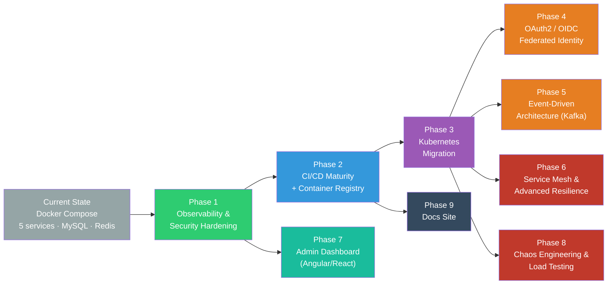
```mermaid
flowchart LR
    A["Current State\nDocker Compose\n5 services · MySQL · Redis"] --> B["Phase 1\nObservability &\nSecurity Hardening"]
    B --> C["Phase 2\nCI/CD Maturity\n+ Container Registry"]
    C --> D["Phase 3\nKubernetes\nMigration"]
    D --> E["Phase 4\nOAuth2 / OIDC\nFederated Identity"]
    D --> F["Phase 5\nEvent-Driven\nArchitecture (Kafka)"]
    D --> G["Phase 6\nService Mesh &\nAdvanced Resilience"]
    B --> H["Phase 7\nAdmin Dashboard\n(Angular/React)"]
    D --> I["Phase 8\nChaos Engineering &\nLoad Testing"]
    C --> J["Phase 9\nDocs Site"]

    style A fill:#95A5A6,color:#fff
    style B fill:#2ECC71,color:#fff
    style C fill:#3498DB,color:#fff
    style D fill:#9B59B6,color:#fff
    style E fill:#E67E22,color:#fff
    style F fill:#E67E22,color:#fff
    style G fill:#C0392B,color:#fff
    style H fill:#1ABC9C,color:#fff
    style I fill:#C0392B,color:#fff
    style J fill:#34495E,color:#fff
```

---

### Phase 1 — Observability & Security Hardening

#### Current State
Each service only exposes basic health/info parameters (`management.endpoints.web.exposure.include=health,info`). There are no active metric scrapers, distributed tracing mechanisms, or dependency check scans.

#### Target Architecture
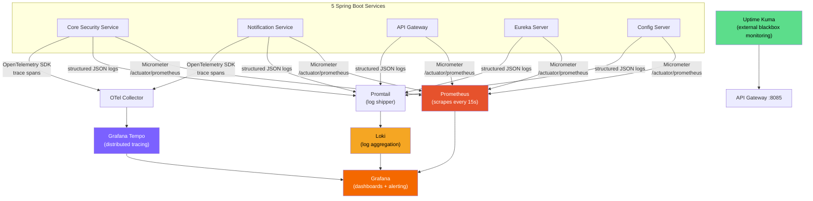
```mermaid
flowchart TB
    subgraph Services["5 Spring Boot Services"]
        S1[Core Security Service]
        S2[Notification Service]
        S3[API Gateway]
        S4[Eureka Server]
        S5[Config Server]
    end

    S1 & S2 & S3 & S4 & S5 -->|"Micrometer\n/actuator/prometheus"| PROM["Prometheus\n(scrapes every 15s)"]
    S1 & S2 & S3 & S4 & S5 -->|"structured JSON logs"| PROMTAIL["Promtail\n(log shipper)"]
    S1 & S2 -->|"OpenTelemetry SDK\ntrace spans"| OTEL["OTel Collector"]

    PROM --> GRAF["Grafana\n(dashboards + alerting)"]
    PROMTAIL --> LOKI["Loki\n(log aggregation)"]
    LOKI --> GRAF
    OTEL --> TEMPO["Grafana Tempo\n(distributed tracing)"]
    TEMPO --> GRAF

    UPTIME["Uptime Kuma\n(external blackbox monitoring)"] --> GW["API Gateway :8085"]

    style GRAF fill:#F46800,color:#fff
    style PROM fill:#E6522C,color:#fff
    style LOKI fill:#F5A623,color:#000
    style TEMPO fill:#7B61FF,color:#fff
    style UPTIME fill:#5CDD8B,color:#000
```

#### Recommended Tools
* **Prometheus & Grafana:** For JVM, connection pool, and HTTP request metrics collection.
* **Loki & Promtail:** For centralized logging.
* **Grafana Tempo / OpenTelemetry Java Agent:** Distributed tracing tracking requests as they flow from the Gateway to the Security and Notification services.
* **Trivy & OWASP Dependency-Check:** Image and dependency vulnerability scanning integrated into CI builds.
* **HashiCorp Vault (OSS):** Replaces raw `.env` database and JWT secrets with dynamic, encrypted credentials.

---

### Phase 2 — CI/CD Maturity & Registry Integration

#### Current State
The GitHub Actions workflow runs compilation steps and builds Docker images locally, but it does not publish images or update deployments.

#### Target Architecture
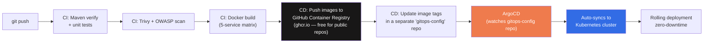
```mermaid
flowchart LR
    A["git push"] --> B["CI: Maven verify\n+ unit tests"]
    B --> C["CI: Trivy + OWASP scan"]
    C --> D["CI: Docker build\n(5-service matrix)"]
    D --> E["CD: Push images to\nGitHub Container Registry\n(ghcr.io — free for public repos)"]
    E --> F["CD: Update image tags\nin a separate 'gitops-config' repo"]
    F --> G["ArgoCD\n(watches gitops-config repo)"]
    G --> H["Auto-syncs to\nKubernetes cluster"]
    H --> I["Rolling deployment\nzero-downtime"]

    style E fill:#181717,color:#fff
    style G fill:#EF7B4D,color:#fff
    style H fill:#326CE5,color:#fff
```

#### Recommended Tools
* **GitHub Container Registry (ghcr.io):** For hosting built Docker images.
* **ArgoCD:** Watches configuration repositories to reconcile live cluster states with declarative Git configurations.
* **Renovate Bot:** Automated dependencies update requests.

---

### Phase 3 — Kubernetes Migration

#### Target Deployment Topology
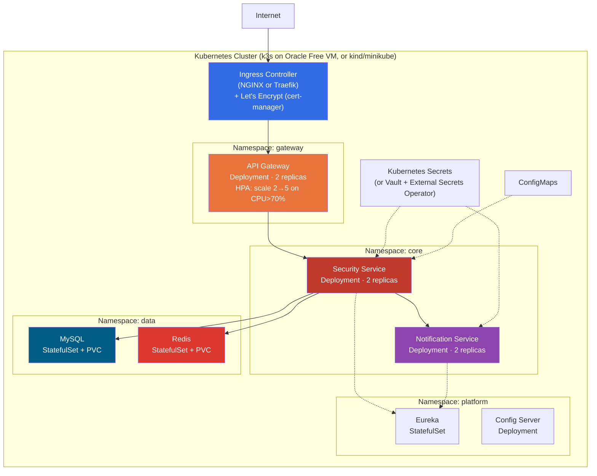
```mermaid
flowchart TB
    subgraph Cluster["Kubernetes Cluster (k3s on Oracle Free VM, or kind/minikube)"]
        ING["Ingress Controller\n(NGINX or Traefik)\n+ Let's Encrypt (cert-manager)"]

        subgraph GWNS["Namespace: gateway"]
            GWPOD["API Gateway\nDeployment · 2 replicas\nHPA: scale 2→5 on CPU>70%"]
        end

        subgraph CoreNS["Namespace: core"]
            SECPOD["Security Service\nDeployment · 2 replicas"]
            NOTIFPOD["Notification Service\nDeployment · 2 replicas"]
        end

        subgraph PlatformNS["Namespace: platform"]
            EUREKAPOD["Eureka\nStatefulSet"]
            CONFIGPOD["Config Server\nDeployment"]
        end

        subgraph DataNS["Namespace: data"]
            MYSQLPOD["MySQL\nStatefulSet + PVC"]
            REDISPOD["Redis\nStatefulSet + PVC"]
        end

        SECRETS["Kubernetes Secrets\n(or Vault + External Secrets Operator)"]
        CM["ConfigMaps"]

        ING --> GWPOD
        GWPOD --> SECPOD
        SECPOD --> NOTIFPOD
        SECPOD --> MYSQLPOD
        SECPOD --> REDISPOD
        SECPOD -.-> EUREKAPOD
        NOTIFPOD -.-> EUREKAPOD
        SECRETS -.-> SECPOD
        SECRETS -.-> NOTIFPOD
        CM -.-> SECPOD
    end

    USER["Internet"] --> ING

    style ING fill:#326CE5,color:#fff
    style GWPOD fill:#E8743B,color:#fff
    style SECPOD fill:#C0392B,color:#fff
    style NOTIFPOD fill:#8E44AD,color:#fff
    style MYSQLPOD fill:#005C84,color:#fff
    style REDISPOD fill:#DC382D,color:#fff
```

#### Kubernetes Hosting Options
* **kind / Minikube:** For local multi-node cluster verification.
* **k3s on Oracle Cloud Free Tier:** Oracle offers a generous "Always Free" tier providing 4 Ampere ARM compute cores and 24 GB of memory. This is sufficient to host the entire 5-service platform, MySQL, Redis, and monitoring containers in an internet-accessible sandbox at zero cost.

---

### Phase 4 — OAuth2/OIDC Federated Identity

#### Architecture Details
Integrate identity federation ("Sign in with Google/GitHub") using an OIDC-compliant Identity Provider (IdP) such as **Keycloak** or **Spring Authorization Server**. The Gateway redirects users to the IdP for authentication. Downstream microservices trust signed identity tokens issued by this central IdP.

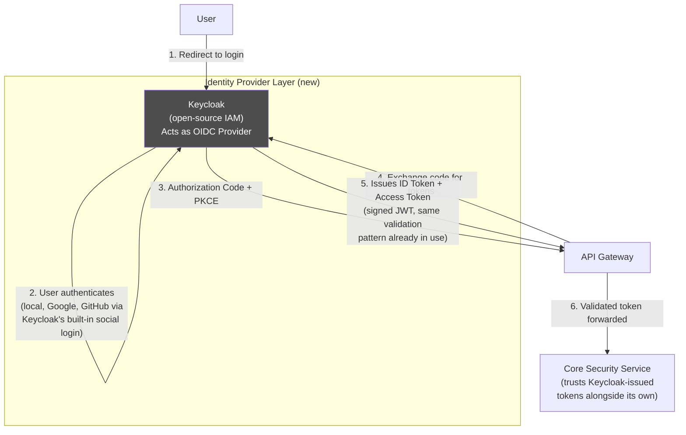
```mermaid
flowchart TB
    subgraph IDP["Identity Provider Layer (new)"]
        KC["Keycloak\n(open-source IAM)\nActs as OIDC Provider"]
    end

    USER["User"] -->|"1. Redirect to login"| KC
    KC -->|"2. User authenticates\n(local, Google, GitHub via\nKeycloak's built-in social login)"| KC
    KC -->|"3. Authorization Code + PKCE"| GW["API Gateway"]
    GW -->|"4. Exchange code for tokens"| KC
    KC -->|"5. Issues ID Token + Access Token\n(signed JWT, same validation\npattern already in use)"| GW
    GW -->|"6. Validated token forwarded"| CORE["Core Security Service\n(trusts Keycloak-issued\ntokens alongside its own)"]

    style KC fill:#4D4D4D,color:#fff
```

---

### Phase 5 — Event-Driven Architecture with Kafka

#### Architecture Details
Migrate synchronous inter-service communication to asynchronous messaging. Core events (like registration OTPs, lockout status updates, and registration submissions) are published to a streaming broker such as **Apache Kafka** or **Redpanda** (which features a lightweight, single-binary C++ engine). This provides durable retry semantics and prevents network latency from affecting the user login thread.

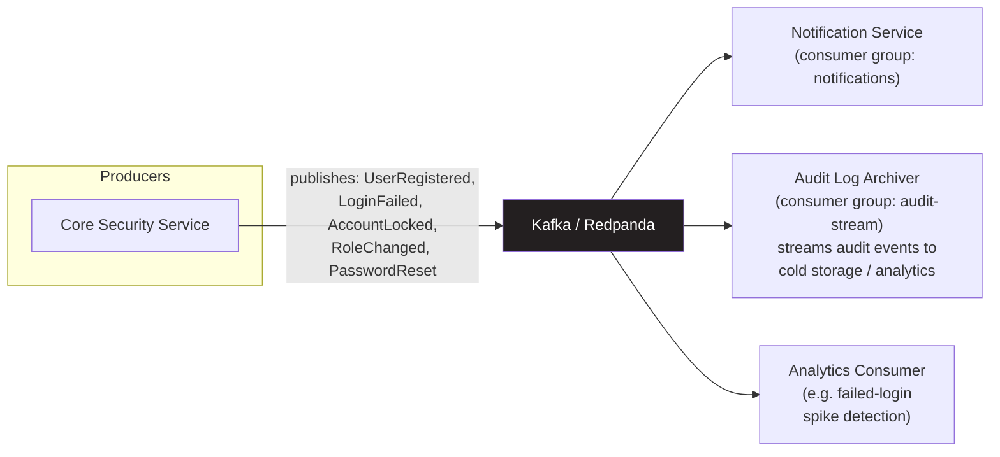
```mermaid
flowchart LR
    subgraph Producers
        AUTH["Core Security Service"]
    end

    AUTH -->|"publishes: UserRegistered,\nLoginFailed, AccountLocked,\nRoleChanged, PasswordReset"| KAFKA["Kafka / Redpanda"]

    KAFKA --> NOTIF["Notification Service\n(consumer group: notifications)"]
    KAFKA --> AUDIT["Audit Log Archiver\n(consumer group: audit-stream)\nstreams audit events to\ncold storage / analytics"]
    KAFKA --> ANALYTICS["Analytics Consumer\n(e.g. failed-login\nspike detection)"]

    style KAFKA fill:#231F20,color:#fff
```

---

### Phase 6 — Service Mesh & Advanced Resilience

#### Architecture Details
Deploy a service mesh like **Istio** or **Linkerd** on Kubernetes. This provides automatic mutual TLS (mTLS) encryption for inter-pod communications, canary deployment routing, and infrastructure-level retry backoffs with circuit breaking, reducing dependence on application-level libraries.

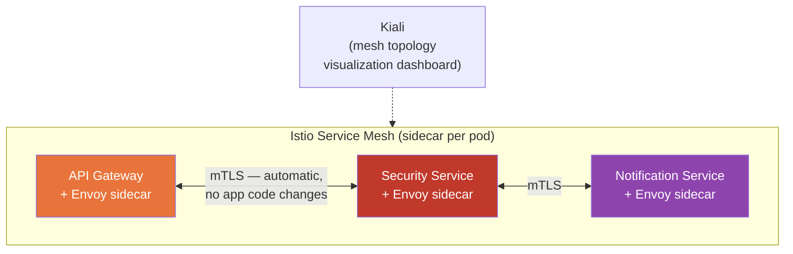
```mermaid
flowchart TB
    subgraph Mesh["Istio Service Mesh (sidecar per pod)"]
        GW["API Gateway\n+ Envoy sidecar"]
        SEC["Security Service\n+ Envoy sidecar"]
        NOTIF["Notification Service\n+ Envoy sidecar"]
    end

    GW <-->|"mTLS — automatic,\nno app code changes"| SEC
    SEC <-->|"mTLS"| NOTIF

    KIALI["Kiali\n(mesh topology\nvisualization dashboard)"] -.-> Mesh

    style GW fill:#E8743B,color:#fff
    style SEC fill:#C0392B,color:#fff
    style NOTIF fill:#8E44AD,color:#fff
```

---

### Phase 7 — Admin Operating Dashboard

#### Architecture Details
Develop a frontend single-page application (SPA) using React or Angular. This UI communicates through the Gateway, utilizing existing secure endpoints (like `/api/v1/auth/sessions` and `/api/v1/admin/statistics/security`) to provide a visual dashboard for user lock/unlock actions, pending registrations, session management, and live audit logging streams.

---

### Phase 8 — Chaos Engineering & Load Testing

#### Architecture Details
Validate resilience claims by running automated experiments:
* **Load Testing with k6:** Script high-concurrency login scenarios to verify Redis-backed lockouts and capture system latency metrics.
* **Chaos Engineering with Chaos Mesh or Pumba:** Simulate network latency or shut down instances of the Notification Service to confirm the Core Security Service handles failures gracefully (fire-and-tolerate design).

---

### Phase 9 — Documentation Site
Set up a dedicated documentation portal using **Docusaurus** hosted on GitHub Pages, providing comprehensive API specs, setup instructions, and architecture diagrams.

---

## 👤 About the Engineer

**Amarender Reddy Voladri**
Java Backend Developer | Spring Boot · Distributed Systems · Identity & Access Management

This platform was built to internalize how enterprise platform and security engineering teams architect distributed authentication and authorization infrastructure.

[](https://github.com/amarenderreddyvoladri)
[](https://amarenderreddyvoladri-portfolio.netlify.app)
[](https://linkedin.com/in/amarender-reddy-voladri)

---

<div align="center">

**⭐ If this architecture is a useful reference for your backend design, consider starring the repository.**

</div>
