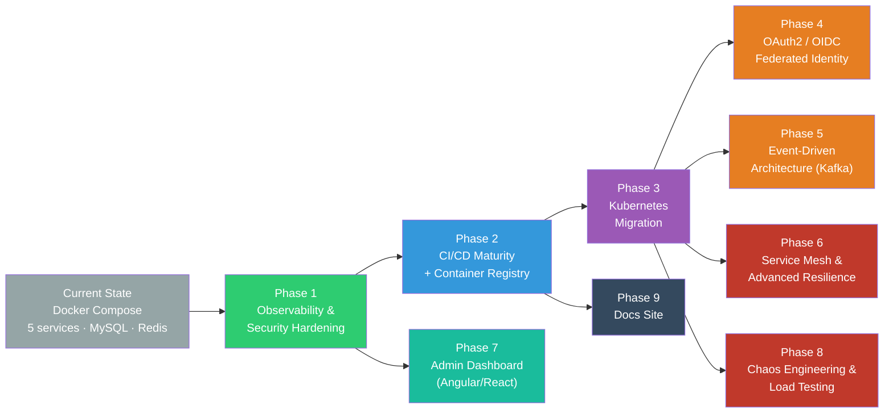
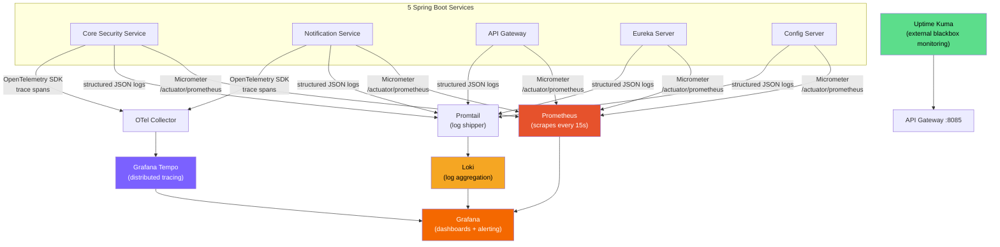
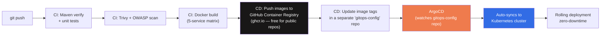
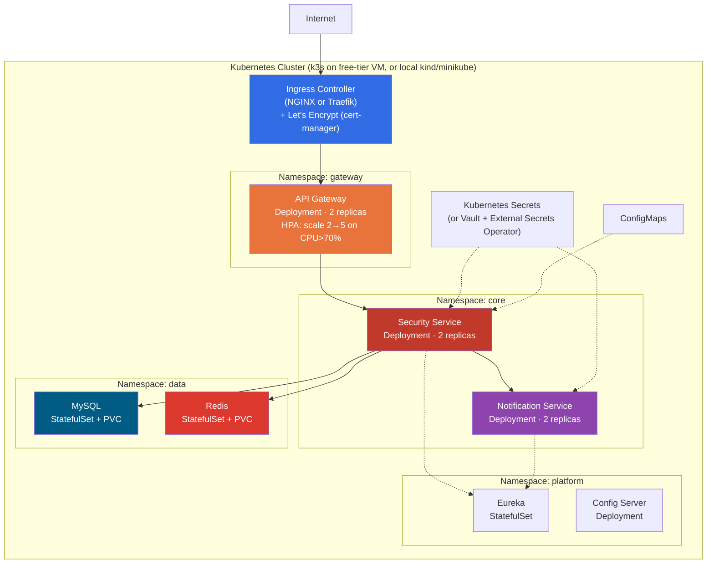
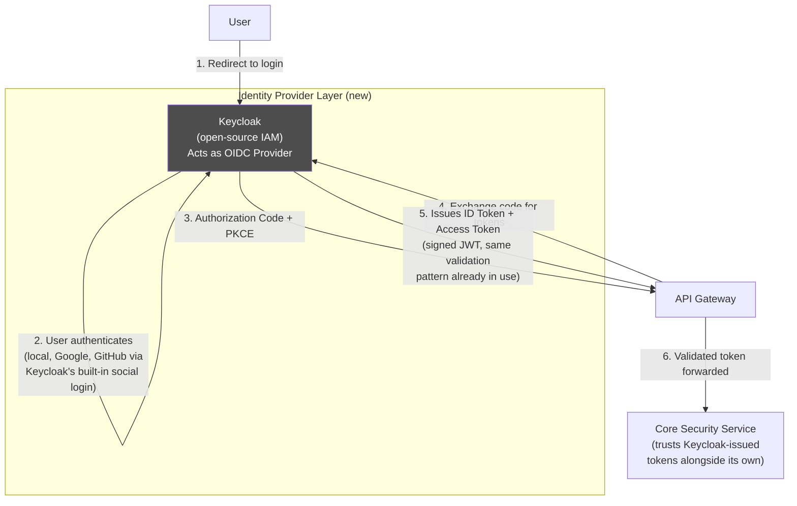
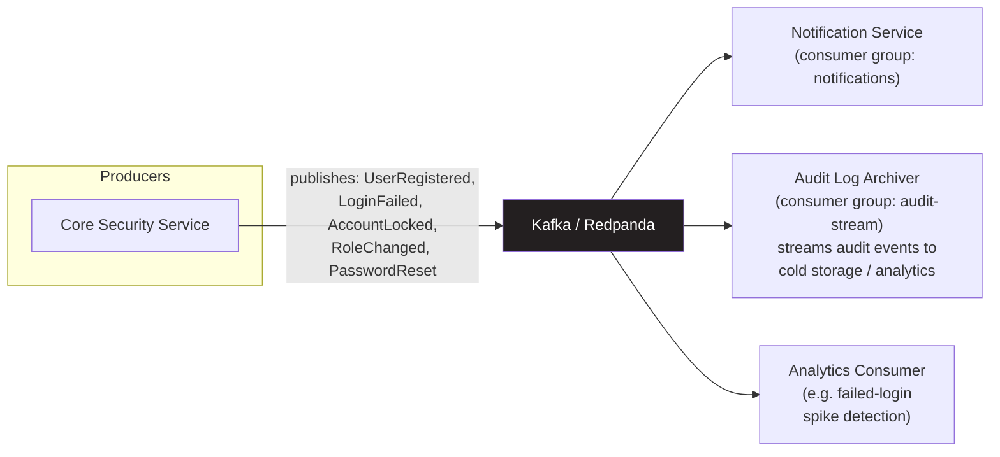
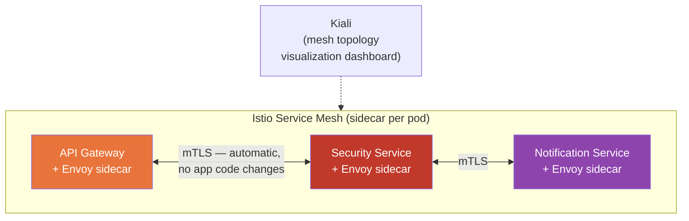
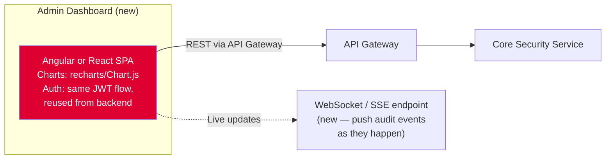

# Architecture Roadmap
### Evolving `production-prototype-security-template` from a Microservices Prototype into a Cloud-Native Identity Platform

**Status:** Planning document — describes future work, not yet implemented.
**Scope:** Architecture evolution and a phased implementation plan, using free-tier / open-source tooling only — no paid infrastructure required for any phase below.

---

## How to read this

Each phase is independent and can be built on its own. They're ordered the way a platform team would typically sequence them — observability and security hardening before Kubernetes, Kubernetes before a service mesh, etc. Pick any subset based on time available.

The current platform (5 services, JWT/RBAC, Redis, MySQL, Docker Compose, Eureka, Config Server — documented in `README.md`) has no metrics/tracing endpoints beyond `health,info`, no image publishing or deployment step past `docker build`, no Kubernetes manifests, no OAuth2/OIDC, and no monitoring stack. Every recommendation below fills one of those specific, verified gaps.

---

## Phase 1 — Observability & Security Hardening

### Current gap
Every service exposes only `management.endpoints.web.exposure.include=health,info` (verified in every `application.properties` in the repo). There is no `/metrics` endpoint, no Prometheus scraping, no distributed tracing, no centralized log aggregation, and no dependency/container vulnerability scanning in CI.

### Target architecture

### Free tools — monitoring & observability

| Tool | What it does | Notes | Hosting |
|---|---|---|---|
| **Prometheus** | Metrics collection + time-series DB | Integrates natively with Spring Boot via Micrometer | Self-hosted (Docker container, free) |
| **Grafana** | Dashboards, visualization, alerting | Large library of pre-built Spring Boot dashboards to import | Self-hosted or [Grafana Cloud free tier](https://grafana.com/products/cloud/) — 10k metrics series, 50GB logs, 50GB traces/mo |
| **Loki** | Log aggregation ("Prometheus for logs") | Lighter than the ELK stack, pairs natively with Grafana | Self-hosted, free |
| **Grafana Tempo** (or **Jaeger**) | Distributed tracing across the 5 services | Traces a single request as it flows Gateway → Security Service → Notification Service | Self-hosted, free |
| **Micrometer + `micrometer-registry-prometheus`** | Spring Boot library exposing `/actuator/prometheus` | One dependency + one property change per service | Free, Apache 2.0 |
| **OpenTelemetry Java agent** | Auto-instruments tracing with zero code changes (Java agent flag) | Vendor-neutral standard, works with Tempo, Jaeger, or any OTLP backend | Free, CNCF project |
| **Uptime Kuma** | Self-hosted external "is it up" monitoring with a status page | Single Docker container | Self-hosted, free |
| **SigNoz** | All-in-one APM (metrics + traces + logs in one tool) | Alternative to running Prometheus+Loki+Tempo+Grafana separately | Self-hosted, free (OSS) |
| **cAdvisor** | Per-container CPU/memory/network metrics | Pairs with Prometheus | Self-hosted, free |

### Security hardening additions

| Tool | Purpose | Where it plugs in |
|---|---|---|
| **Trivy** | Container image vulnerability scanning | New CI job — scan every built image before deployment |
| **OWASP Dependency-Check** | Scans `pom.xml` dependencies for known CVEs | Maven plugin, runs in the `maven-verify` CI job |
| **GitHub CodeQL** | Static analysis for security bugs (SQL injection, etc.) | Free for public repos, one GitHub Actions workflow file |
| **SonarCloud** | Code quality + security hotspots + test coverage tracking | Free for public/open-source repos |
| **HashiCorp Vault** (OSS) | Replace `.env` file secrets with a real secrets manager (dynamic DB credentials, encrypted KV store) | Self-hosted, free |

### Implementation steps
1. Add `spring-boot-starter-actuator` + `micrometer-registry-prometheus` to all 5 `pom.xml`s (Core Security Service already has actuator; the others need the Prometheus registry dependency added).
2. Change `management.endpoints.web.exposure.include=health,info` → `health,info,prometheus,metrics` in each `application.properties`.
3. Add a `monitoring/docker-compose.yml` with `prometheus`, `grafana`, `loki`, `promtail`, `tempo` containers, kept separate from the main compose file so the app stack and observability stack can be started independently.
4. Import the Spring Boot 3 Prometheus/Grafana dashboard (dashboard ID `12900`) for immediate JVM/HTTP/DB-pool visualizations.
5. Add `trivy-scan` and `owasp-dependency-check` jobs to `.github/workflows/ci.yml`, running after `docker-build`.

---

## Phase 2 — CI/CD Maturity: From CI to CD

### Current state
The existing pipeline (`.github/workflows/ci.yml`) handles CI well: Maven verify → matrix Docker build (5 services) → full Compose smoke test with a live login check. What's missing is CD — there is no image publishing step and no deployment step (`push: false` in the Docker build job).

### Target architecture

### Free tools

| Tool | Purpose | Free tier |
|---|---|---|
| **GitHub Container Registry (ghcr.io)** | Host Docker images | Free, unlimited storage/bandwidth for public repositories |
| **GitHub Actions** | Already in use — extend it | Free, unlimited minutes for public repos |
| **ArgoCD** (OSS) | GitOps continuous deployment — declarative, auto-syncs cluster state to Git | Free, open-source, self-hosted inside your own cluster |
| **Semantic Release** / Conventional Commits | Auto-generate version numbers + changelogs from commit messages | Free npm/Maven plugin — the commit style already in use just needs automating |
| **Renovate Bot** | Automated dependency-update PRs | Free for public repos |

### Implementation steps
1. Add a `docker-push` job after `docker-build` — tag images as `ghcr.io/amarenderreddyvoladri/<service>:${{ github.sha }}` and `:latest`, push using `GITHUB_TOKEN` (already available, no new secrets needed).
2. Create a second repo (`security-platform-gitops`) containing only Kubernetes manifests / Helm values — the GitOps source of truth ArgoCD watches.
3. Add a final CI step that bumps the image tag in the gitops repo via a PR (or direct commit for a personal project).
4. Install ArgoCD (one Helm chart) into the Kubernetes cluster from Phase 3, point it at the gitops repo.
5. Add branch protection + required status checks on `master`.

---

## Phase 3 — Kubernetes Migration

### Why
Docker Compose containerizes the system; it doesn't handle scaling, self-healing, rolling updates, or ingress routing. This phase moves that operational layer onto Kubernetes.

### Target architecture

### Free ways to run a Kubernetes cluster

| Option | Best for | Cost | Notes |
|---|---|---|---|
| **kind** (Kubernetes IN Docker) | Local development, CI integration tests | Free, forever | Multi-node cluster inside Docker in seconds — test manifests before any real deploy |
| **minikube** | Local development, learning | Free, forever | Widely documented, good `dashboard` addon |
| **k3s** (lightweight Kubernetes) | A persistent, real cluster | Free, forever | Single binary, production-grade, small footprint |
| **Oracle Cloud "Always Free" tier** | Hosting a real, always-on k3s cluster | Free forever (not a trial) — 4 Ampere ARM cores + 24GB RAM total, across up to 4 VMs | Enough compute to run this entire platform (5 services + MySQL + Redis + Prometheus/Grafana) on a real, internet-reachable cluster, at zero cost, indefinitely |
| **Civo Kubernetes** | A managed K8s control plane, quick to try | $250 free credit for new accounts | Time-boxed |
| **Google Kubernetes Engine (GKE) Autopilot** | Managed K8s with a genuine always-free allowance | 1 zonal cluster's management fee waived; compute still billed (new accounts also get $300/90-day credit) | Not indefinitely free like Oracle |

**Recommended path:** build and test locally with `kind`, deploy the real, permanent cluster on Oracle Cloud's Always Free tier using `k3s`.

### Implementation steps
1. Write Kubernetes manifests (or a Helm chart) per service: `Deployment`, `Service`, `ConfigMap`, `Secret`, `HorizontalPodAutoscaler`.
2. Convert MySQL and Redis to `StatefulSet` + `PersistentVolumeClaim` (or a `Deployment` + PVC as a simpler, acceptable option for a single-replica DB).
3. Replace the Docker Compose `depends_on: condition: service_healthy` pattern with Kubernetes readiness/liveness probes hitting each service's `/actuator/health`.
4. Install an Ingress controller (NGINX Ingress) + cert-manager (auto-provisions Let's Encrypt TLS certificates) for HTTPS.
5. Add a `HorizontalPodAutoscaler` on the API Gateway and Security Service.
6. Provision the free Oracle Cloud VM, install k3s (`curl -sfL https://get.k3s.io | sh -`), point ArgoCD (Phase 2) at it.

---

## Phase 4 — OAuth2 / OIDC & Federated Identity

### Why
The platform currently does username/password + self-issued JWT. This phase adds identity federation (SSO, "Sign in with Google") alongside the existing system, not as a replacement.

### Target architecture

### Free tools

| Tool | Purpose | Notes |
|---|---|---|
| **Keycloak** (OSS, Red Hat) | Full OIDC/OAuth2/SAML identity provider — social login, MFA, admin console | Self-hosted, one Docker container |
| **Spring Authorization Server** | Alternative to Keycloak, for implementing the OAuth2 provider directly in Spring | Official Spring project |
| **Google OAuth2 / GitHub OAuth Apps** | "Sign in with Google/GitHub" | Free for personal/dev apps, no approval process needed |
| **Auth0 free tier** | Hosted alternative to self-hosting Keycloak | Free up to 7,000 monthly active users |

### What this adds on top of the existing JWT/RBAC system
- Delegated authorization — a third-party app could request limited, scoped access to a user's account without seeing their password.
- Social login as an alternative to the existing registration/OTP flow.
- Single Sign-On across multiple future services/apps sharing one identity provider — directly relevant given the second planned project (Django/Angular onboarding system) that could share the same identity layer.

### Implementation steps
1. Deploy Keycloak locally via Docker, create a realm (`security-platform`), register the API Gateway as a confidential client.
2. Configure Keycloak's built-in Google/GitHub identity brokering.
3. Update `JwtFilter` to accept both internally-issued tokens and Keycloak-issued tokens (validate against Keycloak's JWKS endpoint for the latter).
4. Document the hybrid model explicitly: the platform still owns its own IAM for username/password + RBAC + audit, and additionally supports federated OIDC login for SSO/social-login use cases.

---

## Phase 5 — Event-Driven Architecture with Kafka

### Why
Core Security Service → Notification Service communication is currently synchronous REST (`WebClient`). This phase moves non-critical-path events to an async model.

### Target architecture

### Free tools

| Tool | Purpose | Notes |
|---|---|---|
| **Redpanda** | Kafka-API-compatible streaming platform | Lighter than running Kafka+Zookeeper — single binary, self-hosted, free |
| **Apache Kafka** (self-hosted) | The reference implementation, via `docker-compose` | Free, open-source |
| **Confluent Cloud free tier** | Hosted Kafka | Free tier with usage limits |
| **Spring for Apache Kafka** | Producer/consumer integration | Official Spring project |

### What moves to events, and what stays synchronous
- **Move to Kafka:** registration OTP emails, role/status change notifications, force-logout alerts — none of these need to block the caller, and Kafka gives durable retry semantics that the current try/catch WebClient pattern doesn't (a message survives a Notification Service restart; an in-flight blocked HTTP call doesn't).
- **Keep synchronous:** the JWT validation path and login flow — these need an immediate answer, so introducing eventual consistency there would be the wrong trade-off.

### Implementation steps
1. Add Redpanda (or Kafka) as a new service in `docker-compose.yml`.
2. Define event schemas (Avro or versioned JSON) for `UserRegistered`, `LoginFailed`, `AccountLocked`, `RoleChanged`.
3. Replace direct `NotificationFacade` calls for non-critical notifications with a Kafka producer; Notification Service gains a `@KafkaListener` consumer alongside its existing REST endpoint (keep both — REST for synchronous/critical needs, Kafka for the rest).
4. Add a dead-letter topic + retry policy.

---

## Phase 6 — Service Mesh & Advanced Resilience

### Target architecture

### Free tools

| Tool | Purpose |
|---|---|
| **Istio** | Service mesh — automatic mutual TLS between pods, traffic shaping (canary releases, traffic splitting), fine-grained observability, no application code changes |
| **Linkerd** | Lighter-weight alternative to Istio, simpler to operate |
| **Kiali** | Visual dashboard showing service mesh topology and live traffic |

### What this adds beyond Resilience4j
- mTLS between every service automatically — currently, inter-service calls (WebClient → Notification Service) are plain HTTP inside the Docker network. A mesh adds encryption-in-transit and cryptographic service identity with no code changes.
- Traffic shaping — canary deployments, automatic retries with backoff at the infrastructure layer, and fault injection for testing (deliberately inject latency/errors to test existing resilience patterns — ties directly to the WebClient timeout issue already tracked in the issue list).

---

## Phase 7 — Admin Dashboard (Angular/React Frontend)

### Why
A pure backend/API system has no interface for operating it day to day. A thin admin dashboard exposes the platform's existing capabilities visually: live sessions, audit log stream, user management, security statistics.

### Target architecture

### What it shows (backed by existing endpoints)
- Live session table — `/api/v1/auth/sessions`.
- Security statistics dashboard — `/api/v1/admin/statistics/security` (active/revoked tokens, locked accounts).
- Audit log stream — `/api/v1/admin/audit/logs`, optionally upgraded to push live via a new WebSocket/SSE endpoint.
- User & role management UI — a form-based frontend over the existing `updateUserRole` / `updateUserStatus` / lock / unlock endpoints.
- Pending registration approvals — a UI over the existing hierarchical approval workflow (`RegistrationApprovalController`).

### Free tools
Angular or React + free chart libraries (`recharts`, `Chart.js`) + free component libraries (Angular Material, or MUI/shadcn for React).

---

## Phase 8 — Chaos Engineering & Load Testing

### Why
This validates the resilience claims already documented in the README — fire-and-tolerate, circuit breakers, auto-scaling — instead of only asserting them.

### Free tools

| Tool | Purpose |
|---|---|
| **k6** (Grafana) | Open-source load testing, scriptable in JavaScript, integrates with Grafana for live results |
| **Gatling** | Alternative load-testing tool, Scala-based, HTML reports |
| **Chaos Mesh** | Kubernetes-native chaos engineering — kill pods, inject network latency, simulate a MySQL outage, declaratively |
| **Pumba** | Docker-native chaos tool for pre-Kubernetes setups — kills/pauses/adds network latency to specific containers |

### Concrete experiments
1. Kill the Notification Service mid-load-test → verify logins/registrations still succeed (validates the fire-and-tolerate claim — this would currently fail to fully validate until the WebClient timeout issue from the tracked issues is fixed).
2. Inject latency into MySQL → verify the circuit breaker at the Gateway trips and the fallback controller returns a clean `503`.
3. Load-test the login endpoint with k6 → verify the Redis-backed login-attempt-lockout holds up under concurrent load, and capture real numbers (requests/sec, p95 latency).

---

## Phase 9 — Documentation Site

### Free tools

| Tool | Purpose |
|---|---|
| **Docusaurus** (Meta, OSS) | Turns the README + architecture docs into a searchable, versioned documentation site |
| **GitHub Pages** | Free static hosting for the docs site (and for the Phase 7 dashboard, if built as a pure SPA) |
| **Excalidraw** / **Mermaid** (already used in the README) | Diagramming |

### Implementation steps
1. Stand up Docusaurus, migrate the README's sections into docs pages (Architecture, API Reference, Setup, Roadmap).
2. Deploy via GitHub Pages under a custom path.
3. Link the docs site from the top of the main README.

---

## Tech Stack Addition Summary

| Category | Current | Proposed Addition | Free? |
|---|---|---|---|
| Orchestration | Docker Compose | Kubernetes (k3s on Oracle Always Free) | Yes, free forever |
| Deployment strategy | Manual `docker compose up` | ArgoCD (GitOps) | Yes, free OSS |
| Container registry | None (images not pushed) | GitHub Container Registry (ghcr.io) | Yes, free for public repos |
| Metrics | None | Prometheus + Micrometer | Yes, free OSS |
| Dashboards | None | Grafana (self-hosted or free cloud tier) | Yes |
| Logs | Per-container `docker logs` only | Loki + Promtail | Yes, free OSS |
| Tracing | None | OpenTelemetry + Tempo/Jaeger | Yes, free OSS |
| Uptime monitoring | None | Uptime Kuma | Yes, free, self-hosted |
| Vulnerability scanning | None | Trivy + OWASP Dependency-Check + CodeQL | Yes (CodeQL free for public repos) |
| Code quality | None | SonarCloud | Yes, free for public repos |
| Identity | Custom JWT/RBAC only | Keycloak (OIDC/OAuth2), hybrid model | Yes, free OSS |
| Messaging | Synchronous REST only | Kafka / Redpanda | Yes, free OSS |
| Service-to-service security | Plain HTTP + API key | Istio/Linkerd (mTLS) | Yes, free OSS |
| Secrets | `.env` file | HashiCorp Vault | Yes, free OSS |
| Frontend | None | Angular/React admin dashboard | Yes |
| Load/chaos testing | None | k6 + Chaos Mesh | Yes, free OSS |
| Docs | Single README | Docusaurus on GitHub Pages | Yes |

Total additional infrastructure cost across all 9 phases: $0. Every tool listed is either open-source and self-hostable, or has a free tier sufficient to build and run this entire roadmap.
